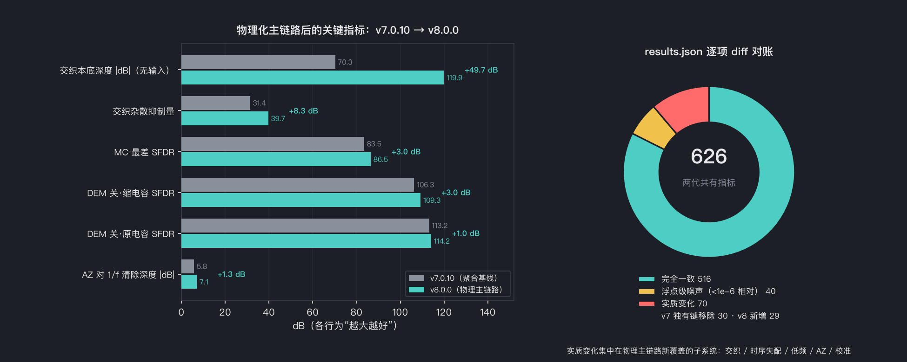
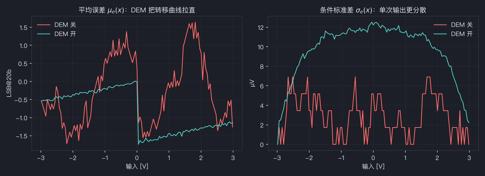
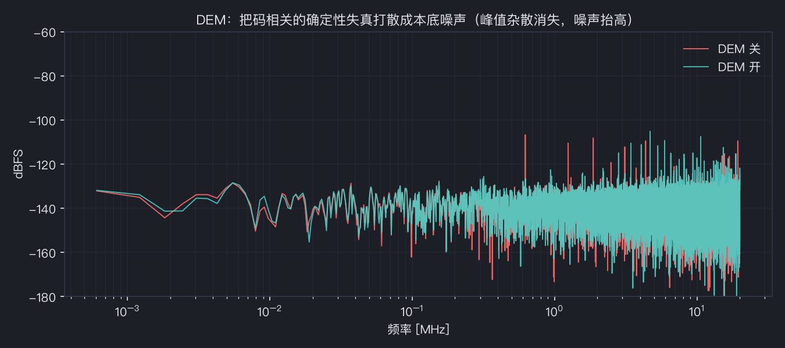
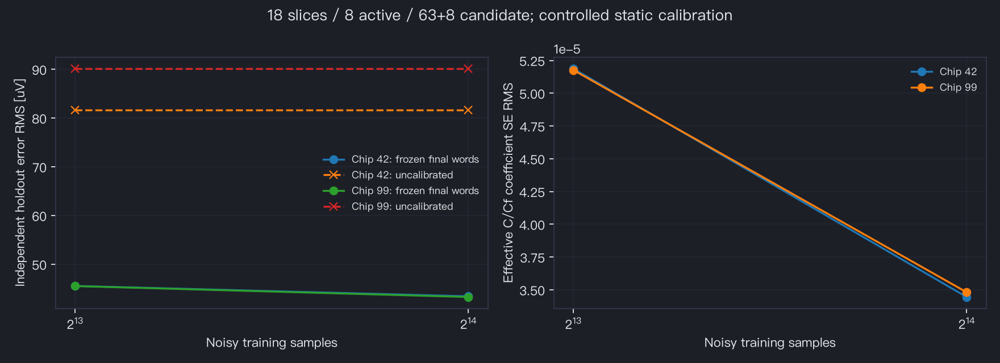
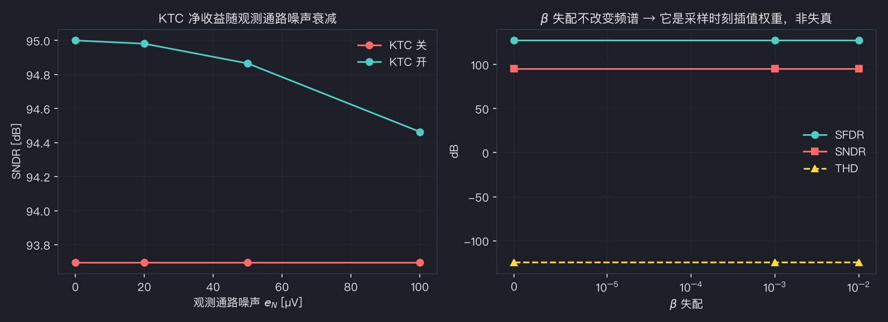
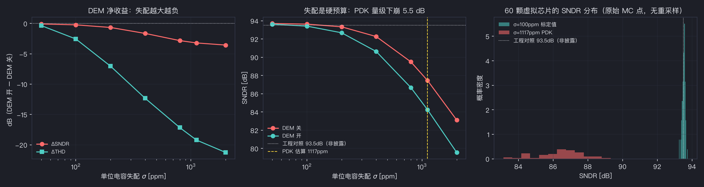
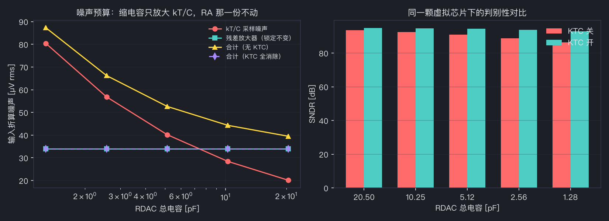
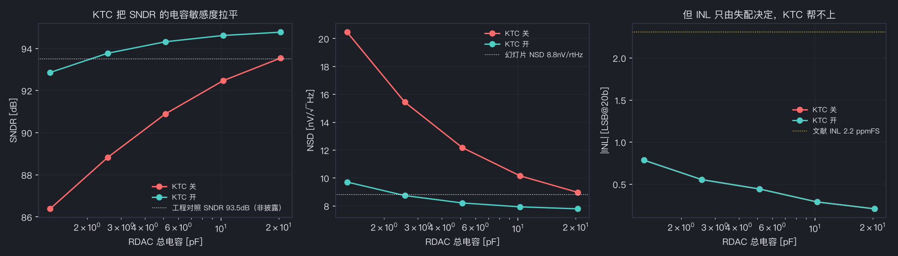
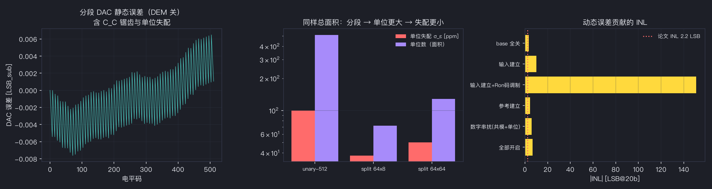

# 20 位 SAR ADC 行为验证

> RTL 结构与校准更新（2026-09-20）：默认顶层为双 SAR / 共享3-bit Flash / 18-slice调度；旧粗细码向量请显式使用 `P_STRUCTURAL=0`。详见 [结构与数字校正说明](docs/rtl/STRUCTURAL_CALIBRATION_20260920.md) 与相应 ADR0018。文献披露、工程假设和模拟签核边界分别列出。


[](https://github.com/defineiocc02/20bit_SAR_ADC_Behaviour_Verification/actions/workflows/ci.yml)
[English](README_EN.md) · [建模与验证指南](docs/behavioral-closure.md) · [适用范围](docs/model_scope.md) · [实施与证据账本](docs/IMPLEMENTATION_CHECKPOINT.md)

这是基于 ISSCC 2024 Session 9.8 及相关公开论文/专利的 Python 行为模型。
它用于检查电荷、时序、噪声、校准和数字重构是否相互一致，并给出继续仿真的工程依据。
公开资料没有完整披露电路，因此具体电容分配、部分相位时间、DEM 交换方式和 ADC2 范围均保留为明确假设。

## 结果总览（v8.1.0）

v8.0.0 把物理 slice 池、交织预跟踪、辅助输入、参考/RA/ADC2 联立动态与定点数字核接入主链路；
8.1.0 新增数字侧定点 RTL（P0–P3）：可综合校准核、双 SAR/共享 3-bit Flash、18-slice 调度、
Verilator 仿真与变异测试门禁——行为级 results.json 数值与 v8.0.0 逐字节一致。
与 v7.0.10 聚合基线做 `results.json` 逐项对账：**626 个共有指标中 516 个完全一致**，
40 个为浮点级噪声（<1e-6 相对），**70 个实质变化**全部集中在物理主链路新覆盖的子系统；
关键 dB 指标全部向好（详见 [CHANGELOG](CHANGELOG.md) 的字节账）：



核心指标（`paper_literal` 主配置，`results.json` 逐项可查）：

| 指标 | 数值 | 口径 |
|:---|---:|:---|
| ENOB | 20.58 bit | s1 无失配理想链路 |
| SNDR / SFDR | 125.6 / 155.5 dB | s1 无失配理想链路 |
| 输出噪声 rms | ≈1.0 µV | s1 |
| DEM 开/关 SNDR | 93.4 / 93.5 dB | s3 含失配 |
| MC 最差 SFDR | 86.5 dB | `mc_pdk_off` 300 批 |
| 校准后误差贴地比 | 1.006 | `split_calib.noise_off` |

验证图集（由 `tools/run_all.py` 与 `tools/make_readme_compare.py` 生成，随 `results.json` 同步更新）：

| | |
|:---|:---|
|  |  |
| *分段 DAC 静态误差、匹配拓扑对比与 INL 贡献分解* | *DEM 开/关 Spectrum：等权单位置换把失配杂散压回本底* |
|  |  |
| *物理池校准：噪声保留训练、冻结权重、独立记录验证* | *KTC 观测消噪：缩电容与逐相位噪声传递的折中* |
|  |  |
| *失配压力扫描：误差随失配幅值的标度* | *噪声/失配误差预算分解* |
|  |  |
| *参数扫描与可行域* | *分段子 DAC 信号链结构* |

## 1. 当前信号链

连续输入与共享源阻抗 → 实际采集 slice 的保持电荷 → SADC 判决 → RDAC/DEM 开关指令 → 有符号参考负载 → 有限 RA 与 ADC2 采样 → 原始 ADC2 整数码 → 冻结权重与定点重构。

- 物理池默认 18 个 slice，每次 8 个参与转换；采集/转换/备用归属具有因果关系。
- `Config.paper_literal()` 提供 **9 位未知输入判决**、63+8 完整范围拓扑、独立 4 倍 dither 端口的候选。
- `Config()` / `paper_consistent()` 保留历史 **7 位假设基线**。已知 dither 不增加未知输入判决信息，不能用 7+2 证明论文的 9 位量化。
- `run_pipeline` 与 `run_sim_split` 共用物理实现；`run_sim_split_reference` 是独立聚合代数对照。
- 输入预跟踪只使用已经可用的量化决策；辅助输入的驱动/复位电荷分别记账。
- 校准保留噪声，检查完整秩与条件数，训练后冻结，在同一物理芯片的独立记录验证。
- `result.to_codes()` 从原始码和数字开关状态执行 Q30/Q32、96 位受检累加、20 位 offset-binary 输出；`result.out` 保留浮点诊断口径。

## 2. 安装与最小验证

支持 Python 3.10–3.13；运行依赖为 NumPy、SciPy、Matplotlib。建议使用独立虚拟环境。

```bash
python3 -m venv .venv
source .venv/bin/activate
python -m pip install -e '.[dev]'
```

```python
import numpy as np
from adi_model import Config, sine_input
from adi_model.pipeline import run_pipeline
from adi_model.metrics import sine_fit_metrics

cfg = Config.paper_literal(dither_mode="off")
n = 16384
fin = cfg.fs * 307 / n
result = run_pipeline(cfg, sine_input(2.1, fin), n)
words = result.to_codes()
print(sine_fit_metrics(words.voltage, cfg.fs, fin))
print("analog overflow:", np.count_nonzero(words.analog_overflow))
print("output clipping:", np.count_nonzero(words.clipped_low | words.clipped_high))
print(result.effective_config)
```

显式选择论文或幻灯片噪声基准：

```python
from adi_model.benchmarks import PAPER_BENCHMARK, SLIDES_BENCHMARK
from adi_model.weight_calibration import run_with_split_calibration

cfg = PAPER_BENCHMARK.configuration(dither_mode="off", mismatch_sigma0=0.001)
validated = run_with_split_calibration(
    cfg, sine_input(2.2, cfg.fs * 307 / 16384, 0.5), 16384, n_cal=8192
)
print(validated.calibration_report)
registers = validated.state.weight_calibration.to_dict()
words = validated.to_codes()
```

默认训练是受控静态行为测量，保留采样/RA/驱动噪声，并使用独立随机流。
它没有实现片上参考源或校准时序/功耗；训练参考的系统误差需要额外预算。

## 3. 标准验证命令

```bash
ruff check .
ruff format --check .
mypy
pytest -q --cov
adi-run-all --results-dir ./output/verification
adi-make-report --results-dir ./output/verification
```

全量 sweep 包括历史机制基线、新物理参考/RA 检查、64 秒慢噪声状态、两颗完整芯片的不同训练样本数与独立定点验证。
门禁同时检查具体必需判据、数量下限和失败记录，失败时退出非零。
`results.json` 使用 UTF-8 标准 JSON；无法定义的数值记录为 null 并列出字段路径，绝不写入 NaN/Infinity 数字。
HTML 报告使用实际结果生成，区分不同架构/来源及其适用范围。

同一软件环境中重复 sweep 的 `results.json` 要逐字节一致；跨 NumPy/SciPy/BLAS 环境使用数值容差验收。
CI 运行 Python 3.10–3.13 测试、3.12 全量 sweep、独立双次确定性验证。

## 4. 仿真推进顺序

1. **静态电荷与范围**：关闭噪声/动态，检查全部粗进位和 RDAC/RA/ADC2 溢出；确认所选 7/9 位架构。
2. **独立物理实现**：固定 fabrication seed，验证实际 slice、电容、DEM 与 dither 掩码；重用芯片时保留物理参数，显式传运行配置。
3. **噪声和校准**：先完成秩/条件数检查，再比较训练规模与独立验证；保留驱动参考误差和残余失配。
4. **联合动态**：逐项引入共享 Rs、Ron、参考 coarse/fine、RA 带宽/压摆/摆幅、ADC2 宽窄带采样，再组合运行；增加时间步检查收敛。
5. **最终整数码**：测最终码流的 SNDR/SFDR 与溢出；静态均值误差、局部进位扫描和完整码密度 INL/DNL 分别报告。
6. **电路级转交**：用可接受的行为参数区间编写实际 Spectre 子模块规格，再以电路仿真替代假设。

## 5. 来源与边界

| 项目 | 当前口径 |
|---|---|
| 论文 [00] | 94.2 dB DR、9.3 nV/√Hz；独立保存 |
| 幻灯片 [00_1] | 94.6 dB DR、8.8 nV/√Hz、约 40 Hz 转角；独立保存 |
| RA 噪声 | 可由所选 DR 锚点反推；属于拟合，不是性能预测 |
| 参考负载 | 名义轨电压处线性化的实际有符号电荷；峰值 droop 给出适用域 |
| RA/ADC2 动态 | 已建有限信号响应；没有据此声称完整开关噪声传递 |
| 低频噪声 | 显式低截止的平稳慢状态；64 秒稀疏观测保持 40 MHz 物理时钟 |
| 20 位输出 | 有实际受检整数重构；不等于 20 ENOB 或完整芯片码密度证明 |
| KTC 观察器 | 研究扩展，默认关闭；未量化观察支路不进入当前定点接口 |
| PDK / 良率 / 功耗 | 没有器件与版图证据，不作硅级预测 |

详细公式、输入输出单位和测试依据见 [ADR 目录](docs/adr/) 与 [建模指南](docs/behavioral-closure.md)。
历史审计/报告作为版本证据保留，当前能力以适用范围和实施账本为准。

## 6. 工程结构

| 位置 | 职责 |
|---|---|
| `src/adi_model/config.py` | 配置、合法性、派生量与来源分级 |
| `slice_pool.py`, `timing.py`, `pipeline_engine.py` | 物理实例、因果调度与主信号链 |
| `input_network.py`, `pretracking.py` | 共享输入网络和数字可用性 |
| `reference_charge.py`, `conversion.py` | 有符号电荷与联合转换动态 |
| `weight_calibration.py`, `fixed_point.py` | 可辨识训练、冻结系数与整数重构 |
| `metrics.py`, `low_frequency_noise.py` | 频谱口径与慢状态 |
| `closure_experiments.py`, `acceptance.py` | 独立验证协议与必需判据 |
| `serialization.py`, `reporting.py` | 标准数据产物与报告 |
| `tests/`, `tools/`, `docs/adr/` | 回归、全量流程、可追溯设计决策 |

贡献前请运行完整验证，说明数据口径、假设和误差来源。修改物理模型须增加能独立推翻实现的验证；历史数值变动须解释，不用放宽门槛掩盖回归。

## 7. 引用方式

如果这个模型对你的工作有帮助，请引用它——引用里记录了版本号，读者才能复现
你的数字。

```bibtex
@software{zhao_2026_sar_adc_behaviour_model,
  author    = {Zhao, Reed},
  title     = {20-bit SAR ADC Behavioural Verification Model},
  version   = {8.1.0},
  year      = {2026},
  publisher = {GitHub},
  url       = {https://github.com/defineiocc02/20bit_SAR_ADC_Behaviour_Verification},
  license   = {BSD-3-Clause},
  note      = { 独立的学术行为模型；与 Analog Devices, Inc. 无从属、
                无背书、无授权关系。 }
}
```

供 GitHub 的 *Cite this repository* 按钮使用的机器可读元数据在
[`CITATION.cff`](CITATION.cff)。

**请同时引用被建模的架构本身**（见[§8](#8-参考文献) 的 `[00]`）——本仓库是
对那项工作的研究，不替代它。

---

## 8. 参考文献

| 编号 | 文献 |
|:---|:---|
| `[00]` | R. Bodnar 等，"A 9.3 nV/√Hz 20 b 40 MS/s 94.2 dB DR Signal-Chain Friendly Precision SAR Converter"，**ISSCC 2024**，Session 9.8，pp. 182–183。DOI: `10.1109/ISSCC49657.2024.10454329` |
| `[00_1]` | 同一工作的幻灯片（按页引用图与标注） |
| `[09]`–`[14]` | 覆盖量化器/RDAC 分段、采样侧 dither、DEM 排序、交织、辅助输入电荷与低功耗参考的专利族 |

参数级引用写在 `provenance.PARAM_GRADES` 里，一个参数一行。完整的第三方文献
清单（含**不属于**目标芯片的背景架构）见 [`NOTICE`](NOTICE)。

---

## 9. 开源声明与许可

**代码许可：BSD-3-Clause，见 [`LICENSE`](LICENSE)。**
你可以自由使用、修改、再分发本软件（包括商业用途），只需遵守 BSD 的三项
条件：保留版权声明、在二进制分发中复现该声明、不得用作者名义为衍生品背书。

### 9.1 独立性与无从属关系

本仓库是一个**独立的学术行为模型**，与 **Analog Devices, Inc.** **无从属、
无背书、无赞助、无授权**关系。作者与 Analog Devices 无任何隶属关系。

"Analog Devices"、"ADI"、"LTC" 是 Analog Devices, Inc. 的商标。它们在本仓库
中的出现仅为**名义性使用**（nominal use），目的只是标识被研究的公开文献，
**不表示**该公司对本仓库的任何认可。

### 9.2 用了什么、没用什么

| | |
|:---|:---|
| ✅ 使用了 | **仅限已公开**文献：ISSCC 2024 论文与幻灯片、已公开专利、公开数据手册。全部在 [`NOTICE`](NOTICE) 中列明，且**均不在本仓库内再分发**。 |
| ❌ 未使用 | 无任何硅片、网表、版图、PDK、设计数据库、内部文档，也无任何形式的非公开信息。 |

每一个量要么是公开来源转录（`[披露]`），要么是对公开值做代数推导
（`[推导]`），要么是**为复现已发表图表而标定**（`[拟合]`），要么是供敏感性
研究而假设（`[假设]`）。反推得到的参数**不会**被当作对任何产品的独立测量
结果呈现。

### 9.3 无专利许可；无担保

本仓库中的任何内容都**不授予**任何第三方专利或其它知识产权项下的任何许可
（明示或默示）。`NOTICE` 中列出的专利仅作为**机制参考**引用；其中描述的
实施方案**不是**本仓库所发布的实现。

软件按 **"原样"（AS IS）** 提供，不附任何形式的担保；作者不对因使用本软件
而产生的任何索赔或损害负责。它是**研究模型**，**不是**设计签核工具：
**不得**用于量产、安全关键或良率决策。

### 9.4 原创贡献

**KTC 噪声消除支路**（`adi_model/ktc.py`）是本仓库作者的**原创研究扩展**。
它在代码中被分级为 `RESEARCH_EXTENSION`、默认关闭，并且**不是** `[00]` 或
专利 `[09]`–`[14]` 所披露的特性。**请勿将其归属于 Analog Devices。**

### 9.5 对本声明提出异议

如果你认为自己是某项内容的权利人，且认为本仓库存在归属错误或超出许可范围，
请提交
[机密安全公告](https://github.com/defineiocc02/20bit_SAR_ADC_Behaviour_Verification/security/advisories)
或参见 [`SECURITY.md`](SECURITY.md)。归属与许可类更正按**最高优先级**处理。
