# 20-bit SAR ADC behavioural verification

> An **auditable** high-precision SAR ADC behavioural model: every parameter carries a
> source grade, every claim traces to a paper, a patent or an explicit assumption, and
> every physical mechanism maps to concrete code and a regression test.

[](https://github.com/defineiocc02/20bit_SAR_ADC_Behaviour_Verification/actions/workflows/ci.yml)
[](LICENSE)
[](pyproject.toml)
[](CHANGELOG.md)

[中文说明（完整版）](README.md) · [Modelling guide](docs/behavioral-closure.md) · [Current scope](docs/model_scope.md) · [Implementation evidence](docs/IMPLEMENTATION_CHECKPOINT.md) · [Patent/paper mapping](docs/engineering_vs_patents_papers.md) · [Key technologies](docs/key_technologies.md)

This project builds a **physical behavioural model of a two-stage residual SAR ADC** in
Python, inspired by ISSCC 2024 Session 9.8 and related published patents/papers. It checks
whether charge, timing, noise, calibration and digital reconstruction are mutually
consistent, and gives the engineering basis for continuing at circuit level. The published
material does not disclose the complete circuit, so capacitor allocation, part of the phase
timing, the DEM exchange scheme and the ADC2 range remain **explicit assumptions** - not
silently filled-in numbers.

---

## Contents

| # | Section | What you get |
|:--|:---|:---|
| [0](#0-what-this-is) | What this is | Positioning, headline numbers, three differentiators |
| [1](#1-scope) | Scope | What it does / does not do (hard boundaries) |
| [2](#2-architecture) | Architecture | Signal chain, per-sample phase pipeline, visibility boundary, RTL |
| [3](#3-modules) | Modules | 48 modules in 9 groups + ten technology pillars |
| [4](#4-correspondence-to-the-paper-and-patents) | **Correspondence to paper/patents** | Mechanism x source matrix, per-patent table, disclosed-value anchors |
| [5](#5-parameter-provenance) | Parameter provenance | Grade composition of all 93 parameters (runtime ledger) |
| [6](#6-verification-methodology) | Verification methodology | Dual implementations, independent oracle, gates, nails |
| [7](#7-results-at-a-glance) | Results at a glance | v8.x headline metrics and figure set |
| [8](#8-install-and-minimal-run) | Install and minimal run | Three commands to the first sample stream |
| [9](#9-standard-verification-commands) | Standard verification commands | Gates, full sweep, report generation |
| [10](#10-simulation-order) | Simulation order | Six steps from static charge to circuit hand-off |
| [11](#11-sources-and-limits) | Sources and limits | Current caveats and claims that are *not* supported |
| [12](#12-repository-layout) | Repository layout | Directory responsibilities, contribution rules |
| [13](#13-citation) | Citation | BibTeX and `CITATION.cff` |
| [14](#14-references) | References | Modelled architecture and mechanism patents |
| [15](#15-license-and-declarations) | License and declarations | Independence, no patent licence, original contributions |

---

## 0. What this is

A **behavioural** model (not device-level, not layout-level) that computes the physical chain
of a 20-bit 40 MS/s precision SAR ADC - sampling network, quantizer, residue DAC, shared
residue amplifier, backend ADC and digital reconstruction - phase by phase in the time
domain, and can say **where each number came from**.

| Dimension | Fact |
|:---|:---|
| Code size | **48 modules / 18,913 lines** of Python plus fixed-point RTL, synthesis flow and simulation vectors |
| Provenance | **All 93 parameters graded**: `[disclosed]` 9, `[derived]` 8, `[fitted]` 3, `[assumed]` 65, `[research extension]` 8 |
| Mechanism coverage | **17 mechanisms** (M01-M16 + X01) each mapped to its literature source and code location |
| Acceptance strength | **52 hard criteria** all passing; 28 unconditional required records enforced individually by `acceptance.py` |
| Regression size | **714 tests** passing; CI covers Python 3.10-3.13, sweep determinism and build artefacts |
| Numerical identity | Repeated sweeps in one environment produce **byte-identical** `results.json`; cross-version changes are reconciled leaf by leaf |

### Three ways this differs from a typical behavioural model

1. **Provenance is a runtime value, not a comment.** `provenance.PARAM_GRADES` turns each
   parameter's grade into assertable code; adding a `Config` field without a grade fails the
   test suite. "Where did this number come from" is a question a program can answer.
2. **Two independent solvers cross-check each other.** The per-phase state machine
   `pipeline.py` and the vectorised `sim_split.py` are **bit-identical** when all
   non-idealities are off, and the charge truth is derived independently in `charge_ref.py`
   without reusing the closed-form solution. A wrong intermediate node cannot hide behind an
   end-to-end result that happens to look right.
3. **The digital side is locked inside the nominal domain.** The calibration/DEM/dither
   numbers are credible because the digital algorithms **cannot read** the physical truth
   `chip.C_true`; physical truth is for post-hoc scoring only. This boundary is enforced by
   acceptance, not by discipline.

---

## 1. Scope

### What it does

- **Physical sampling and slice pool**: fixed per-slice capacitances, bridge/subnode
  parasitics, real DEM masks and sample ownership; an 18-slice pool (8 converting, 8
  acquiring, 2 spare) where the converting group must hold the charge it actually acquired.
- **Continuous input network**: shared source impedance with per-branch nonlinear `Ron` and
  physical source charge; the shared `Rs` is never divided by slice count.
- **Two-stage conversion**: 9-bit first-stage decision (quantizer `sDAC` separate from the
  `RDAC`), residue top-plate hold, signed reference charge events, finite
  gain/bandwidth/slew/swing of the shared RA, ADC2 wide/narrow tracking phases, and reference
  backaction into released slices.
- **Noise and calibration**: noisy identifiable unit-weight training, frozen coefficients,
  held-out validation on the same chip, raw backend words and checked fixed-point output;
  correct one-sided PSD, band integration, alias/rank diagnostics.
- **Digital domain**: Q30/Q32 with 96-bit checked accumulation and 20-bit offset-binary
  output; exhaustive output oracle, all coarse carries, noisy holdout.
- **RTL delivery**: synthesizable calibration core and fixed-point structure (`rtl/`),
  Verilator simulation and mutation gates (`synth/`, `sim/`).

### What it does not do (hard boundaries)

| Boundary | Statement |
|:---|:---|
| No device/layout/transistor measurements | No PDK, layout or silicon data; mismatch, area, power and yield are **sensitivity assumptions** |
| Not an SNDR/DR predictor | The noise budget proves the budget is *satisfiable*, not that the circuit *achieves* it; RA noise is inferred from the chosen DR anchor (`[fitted]`) |
| Reference loading linearised at nominal rails | Peak droop reports the small-error domain, not a nonlinear reference-buffer circuit solve |
| Phase timing and bit-trial order are assumed | No transistor-level timing closure or metastability probability prediction |
| 20-bit output is not 20 ENOB | Real checked integer reconstruction, but not proof of full-chip code-density INL/DNL |
| The KTC branch is an original extension | Not disclosed in `[00]` or patents `[09]`-`[14]`, off by default, **not attributable to ADI** |
| Open items tracked with `xfail(strict=True)` | Fixing one turns it into XPASS, which fails - no stale "done" impression survives |

---

## 2. Architecture

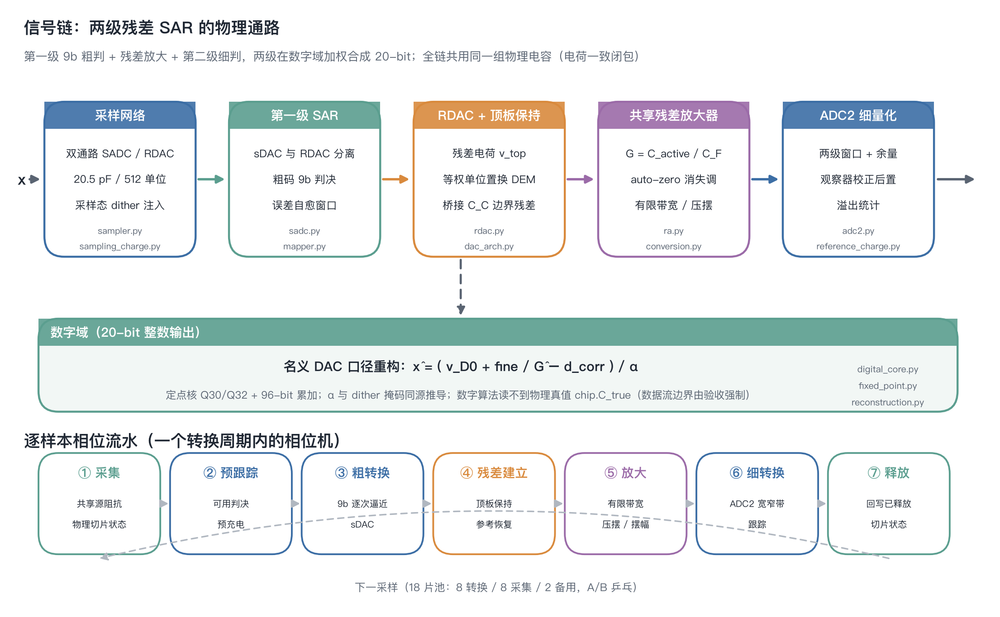

*Figure 1: signal chain (top) and per-sample phase pipeline (bottom). This is an **original
schematic drawn from the published textual description**, not a reproduction of any paper or
patent figure.*

### 2.1 Signal chain: what happens in one conversion

Continuous input with shared source impedance -> held charge on the actually acquired slices
-> SADC decision -> RDAC/DEM switch command -> signed reference load -> finite RA and ADC2
sampling -> raw ADC2 integer words -> frozen weights and fixed-point reconstruction.

| Stage | Code | What it computes |
|:---|:---|:---|
| Sampling network | `sampler.py`, `sampling_charge.py` | Two paths (SADC/RDAC) acquired separately; sampling-domain dither injection costs no input range |
| First-stage decision | `sadc.py`, `mapper.py` | Quantizer **separated** from the residue DAC; coarse error lands inside a self-healing window |
| Residue DAC | `rdac.py`, `dac_arch.py`, `dem.py` | Top-plate residue hold; unary unit permutation; bridge `C_C` boundary residual |
| Residue amplification | `ra.py`, `conversion.py` | Gain `G[n] = C_active[n] / C_F` determined per sample by the capacitors actually used |
| Backend quantisation | `adc2.py`, `reference_charge.py` | Two-stage window with headroom; observer correction applied digitally |
| Digital reconstruction | `digital_core.py`, `fixed_point.py`, `reconstruction.py` | `x_hat = (v_D0 + fine/G_hat - d_corr)/alpha`, with `alpha` derived from the same dither mask |

### 2.2 Per-sample phase pipeline

| Phase | Physics | Constraint / acceptance |
|:---|:---|:---|
| (1) Acquire | Continuous tracking through the shared source impedance; real slice states | KCL / AC / charge conservation and step convergence |
| (2) Pretrack | Precharge using only **already available** quantised decisions | Precharge must affect the real slice and SADC capacitor state |
| (3) Coarse convert | 9-bit successive approximation (`sDAC`) | All coarse carries; zero RDAC/ADC2 overflow |
| (4) Residue settle | Top-plate hold, signed reference charge, coarse/fine reference recovery | Reference perturbation must be written back before slice reuse |
| (5) Amplify | Finite-bandwidth / slew / swing RA | Convolution, repeated poles and an independent ODE cross-check |
| (6) Fine convert | ADC2 wide/narrow tracking with actual aperture | Aperture noise budget accounted separately |
| (7) Release | Reference backaction into released slices | Cross-cycle causality `conv[n] = acq[n-1]` is auditable |

### 2.3 The data-visibility boundary (the methodological core)

```
nominal      v_D0    = DAC_nominal(b)        <- the only DAC domain digital may read
physical     v_Dtrue = DAC_physical(b, chip) <- for analog behaviour and post-hoc scoring
```

Two rules are enforced: (1) `DAC_nominal(M(c, state)) = V_target(c)` holds for **any** DEM
state (a structural property of unary permutation, not a fitted coincidence); (2) the moment
`dac_error` appears on an **algorithm path** the boundary is violated. Violate it once and the
interpretation of every "calibration/DEM/dither gain" number is gone.

### 2.4 Digital side and synthesizable RTL

| Layer | Content | Location |
|:---|:---|:---|
| Fixed-point algorithm model | Q30/Q32, 96-bit checked accumulation, 20-bit offset-binary output, explicit register widths and half-open rounding | `fixed_point.py`, `digital_core.py` |
| Synthesizable RTL | Dual SAR with shared 3-bit Flash, 18-slice scheduling, synthesizable calibration core | `rtl/` |
| Synthesis and simulation | DC synthesis flow, Verilator simulation, mutation-testing gates | `synth/`, `sim/` |
| Interface contracts | RTL arithmetic contract, P1/P2 interface specifications, synthesis review records | `docs/rtl/` |

> **RTL structural update (2026-09-20)**: the default top level is dual SAR with a shared
> 3-bit Flash and 18-slice scheduling; when using the legacy coarse/fine code vectors set
> `P_STRUCTURAL=0` explicitly. See
> [STRUCTURAL_CALIBRATION_20260920.md](docs/rtl/STRUCTURAL_CALIBRATION_20260920.md) and ADR 0018.

---

## 3. Modules

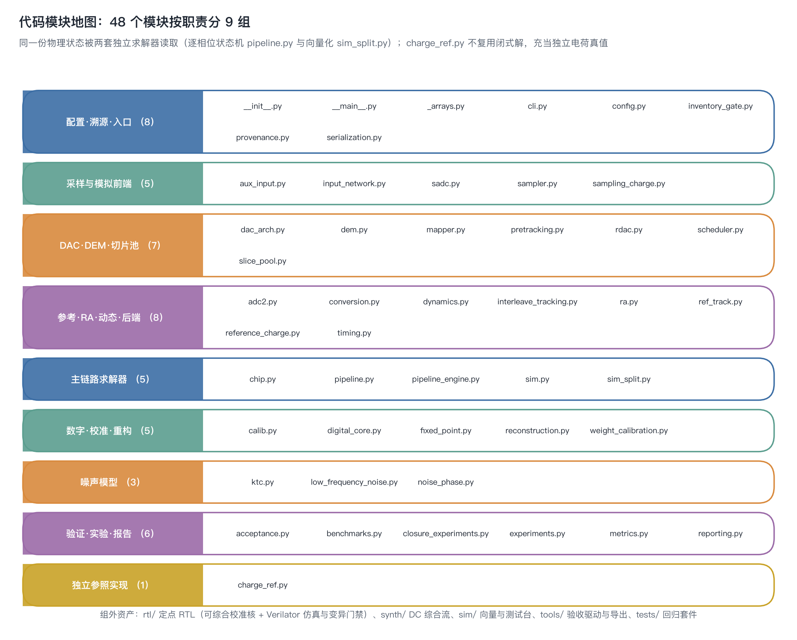

*Figure 2: module map. The grouping is asserted as a **set equality** against the filesystem,
so adding an unlisted module makes the figure generator fail loudly instead of going stale.*

| Group | Modules | Responsibility |
|:---|:---|:---|
| Config, provenance, entry | `config` `provenance` `inventory_gate` `serialization` `_arrays` `cli` | Legality, derived quantities, **parameter provenance**, standard JSON artefacts |
| Sampling and analog front end | `sampler` `sampling_charge` `input_network` `aux_input` `sadc` | Two-path acquisition, shared source impedance, auxiliary charge, coarse decision |
| DAC, DEM, slice pool | `rdac` `dac_arch` `dem` `mapper` `slice_pool` `scheduler` `pretracking` | Exact segmented-DAC solve, unary permutation, physical pool and causal scheduling |
| Reference, RA, dynamics, backend | `ra` `adc2` `conversion` `dynamics` `reference_charge` `ref_track` `interleave_tracking` `timing` | Joint conversion dynamics and the three code-dependent error mechanisms |
| Main-path solvers | `pipeline` `pipeline_engine` `sim` `sim_split` `chip` | Phase state machine and vectorised implementation sharing one physical model |
| Digital, calibration, reconstruction | `digital_core` `fixed_point` `calib` `weight_calibration` `reconstruction` | Identifiable weights, frozen coefficients, checked fixed-point output |
| Noise models | `ktc` `noise_phase` `low_frequency_noise` | Per-phase noise transfer, original KTC cancellation, slow 1/f state |
| Verification, experiments, reporting | `acceptance` `experiments` `closure_experiments` `benchmarks` `metrics` `reporting` | Required-record gates, full experiment sweep, spectral conventions, reports |
| Independent reference | `charge_ref` | Charge-truth solver that does **not** reuse the closed form |

### Ten technology pillars

| # | Technology | One-line principle | Code |
|:--|:---|:---|:---|
| T1 | Charge-consistent closure | One set of `C_active` fixes kT/C noise, RA gain and the KTC `beta` at once | `rdac` `ra` `sim` |
| T2 | Exact segmented-DAC solve | Two floating-node simultaneous solve plus a unified input-referred convention (a 0.9972 convention gap once produced a phantom 143 mV residual) | `dac_arch` `charge_ref` |
| T3 | Nominal/physical separation | Digital may only read the nominal domain | `rdac` `digital_core` |
| T4 | Sampling-domain dither | Inject / re-code / subtract must appear as a triple, `alpha = (N - 2D)/N` | `sampler` `reconstruction` |
| T5 | DEM effective domain | Permutation removes code-dependent mismatch; gain, `C_C`, common-mode crosstalk and main/sub boundary residual are **not** removable | `mapper` `dac_arch` |
| T6 | Rank-aware observability | `rank(U) = 64/512` is a **structural** limit and the criterion for calibration feasibility | `calib` |
| T7 | KTC cancellation (original) | `sigma^2_res = (a - kappa*b)^T Sigma (a - kappa*b) + kappa^2 sigma_eN^2`, jointly optimal `kappa` | `ktc` `noise_phase` |
| T8 | Code-dependent dynamics | Input settling / reference settling / digital crosstalk produce deterministic INL | `dynamics` |
| T9 | Physical pool causality | `conv[n] = acq[n-1]`; shuffling must act on **physical capacitors** | `slice_pool` `scheduler` |
| T10 | Testable methodology | Dual-implementation equality, independent truth, runtime grading, gates, `xfail(strict)` | whole tree |

> Full principles, formulas, counter-examples and "nail" tests: [docs/key_technologies.md](docs/key_technologies.md).

---

## 4. Correspondence to the paper and patents

> **This section is where this project separates itself from a model written from memory.**
> Every mechanism is mapped back to its literature source while stating three things: what
> the source discloses, what the code implements, and how far the two align.
>
> Citation rule: only **entries** (authors / venue / DOI / patent numbers) are cited. The
> originals (PDF, slide deck, patent text) are **not redistributed here**, and every figure in
> this section is an **original redraw from the published textual description**. See [`NOTICE`](NOTICE).

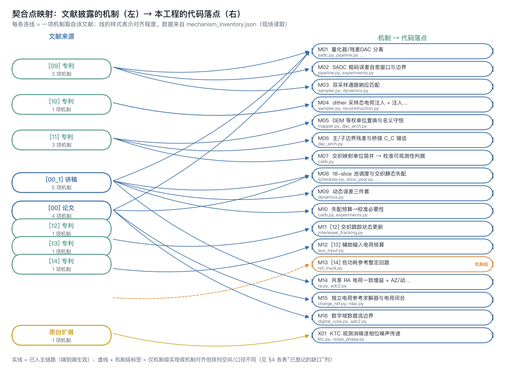

*Figure 3: fit-point overview - the left column is the literature source, the right column the
mechanisms it feeds and this project's code locations. Solid lines are integrated end-to-end;
dashed lines are mechanism-model-only, or aligned in mechanism but different in permutation
space / convention. The number in each source box counts the mechanisms it supports.*

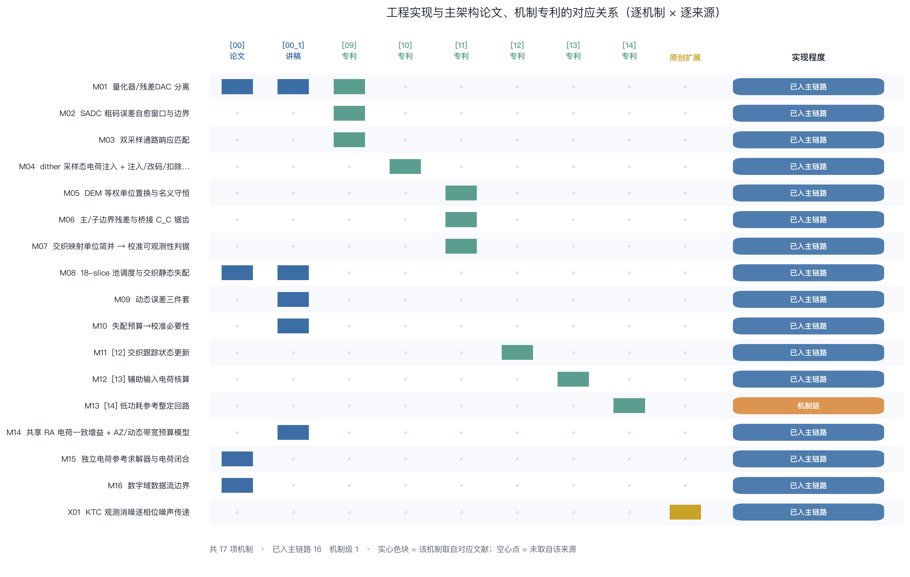

*Figure 4: 17 mechanisms x 9 sources, with the implementation degree on the right. Data comes
from the machine-readable ledger [`mechanism_inventory.json`](mechanism_inventory.json), whose
consistency is checked by `inventory_gate`.*

### 4.1 Source index

| ID | Reference | Role in this project |
|:---|:---|:---|
| `[00]` | R. Bodnar et al., *A 9.3 nV/rtHz 20 b 40 MS/s 94.2 dB DR Signal-Chain Friendly Precision SAR Converter*, **ISSCC 2024**, Session 9.8, pp. 182-183. DOI `10.1109/ISSCC49657.2024.10454329` | **Primary architecture target**: topology, slice pool, shared RA, auto-zero, dither range enhancement |
| `[00_1]` | Presentation slides of the same work (cited page by page) | Parameter source: NSD / DR / G0 / 18-slice structure / noise-cost dB values |
| `[09]` | US 10,516,408 B2 - Analog to digital converter stage | Quantizer separated from residue DAC; coarse-error self-healing window; two sampling paths matched in **response** |
| `[10]` | US 10,505,561 B2 - Method of applying a dither, and ADC | Two physical dither implementations; inject/re-code/subtract triple |
| `[11]` | US 10,511,316 B2 - Linearizing transfer characteristic by DEM | Unary unit permutation DEM; independent main/sub rotation; boundary residual |
| `[12]` | US 10,707,889 B1 - Interleaving method for analog to digital converters | Tracking-state update driven by the other ADC's result |
| `[13]` | US 10,541,702 B1 - Auxiliary input for ADC input charge | Auxiliary input port and its charge accounting |
| `[14]` | US 10,826,519 B1 - Low power reference for an ADC | Low-power reference buffer and its settling loop |
| `[01]`-`[08]` | Hurrell ISSCC 2010, ElShater ISSCC 2019, Li ISSCC 2023, Bannon VLSI 2014, LTC2387-18, Steensgaard ISSCC 2022, TI ADC3583, Shen JSSC 2018 | Background/alternative architectures; **not** modelling sources for the target device |

### 4.2 Per-mechanism mapping (17 items)

| Mechanism | Source | Code | Degree | Registered gap |
|:---|:---|:---|:---|:---|
| M01 Quantizer / residue-DAC separation | `[00]` `[00_1]` `[09]` | `sadc` `pipeline` `config` | Integrated | `b1` reading not unique (`paper_literal` / `legacy_v61` retained) |
| M02 SADC coarse-error self-healing window | `[09]` | `pipeline` `experiments` | Integrated | - |
| M03 Two sampling paths matched in response | `[09]` | `sampler` `dynamics` | Integrated | `sampling_tau_mismatch` value is `[assumed]` |
| M04 Sampling-domain dither + triple | `[10]` | `sampler` `reconstruction` | Integrated | Static linearisation gain is **negative** in this configuration (conditional) |
| M05 Unary permutation DEM, nominal conservation | `[11]` | `mapper` `dac_arch` | Integrated | Joint permutation space **64, not 512** (R16) |
| M06 Main/sub boundary residual and bridge sawtooth | `[11]` | `dac_arch` | Integrated | 3-D mapping realised as this project's candidate |
| M07 Interleave degeneracy -> observability | `[11]` | `calib` | Integrated | Calibration algorithm is this project's, not the chip's |
| M08 18-slice pool scheduling, static interleave mismatch | `[00]` `[00_1]` | `scheduler` `slice_pool` `pipeline` | Integrated | The 31/42 dB suppression figures must not be used as matching budgets |
| M09 Three code-dependent dynamic errors | `[00_1]` | `dynamics` | Integrated | All `dyn_*` are `[assumed]`: use shapes and trends, not values |
| M10 Mismatch budget -> calibration necessity | `[00_1]` | `calib` `experiments` | Integrated | 300 ppm is an `[assumed]` target; yield confidence not converged |
| M11 Interleave tracking-state update | `[12]` | `interleave_tracking` `pretracking` | Integrated | Dielectric-absorption memory-error model not built |
| M12 Auxiliary input charge accounting | `[13]` | `aux_input` `input_network` | Integrated | No disclosed `C_pg` -> ratio is `[assumed]` |
| M13 Low-power reference settling loop | `[14]` | `ref_track` | **Mechanism model** | Settling-loop events not in the main path; error-detectability not modelled |
| M14 Shared RA gain + auto-zero budget | `[00_1]` | `ra` `adc2` | Integrated | Phase-level auto-zero noise transfer not built (budget multipliers only) |
| M15 Independent charge reference solver | `[00]` | `charge_ref` `rdac` | Integrated | SPICE bench not executed (no PDK/licence) |
| M16 Digital data-flow boundary | `[00]` | `digital_core` `adc2` | Integrated | - |
| X01 KTC observed-noise cancellation (**original**) | no literature source | `ktc` `noise_phase` | Integrated | Ideal readout upper bound; swing is not settling |

### 4.3 Per-patent alignment

| Patent | Disclosed core mechanism | Code | Alignment |
|:---|:---|:---|:---|
| `[09]` US 10,516,408 B2 | Quantizer/RDAC separation; coarse-error self-healing window; sampling **response** (not just capacitance) matching; fractional weights by code synthesis | `sadc.py` `sampler.py` `pipeline.py` | Yes - integrated |
| `[10]` US 10,505,561 B2 | Sampling-domain charge-injection dither (no input range cost); inject/re-code/subtract triple; integer dither never enters the coarse code | `sampler.py` `reconstruction.py` | Yes - integrated |
| `[11]` US 10,511,316 B2 | Unary unit permutation; independent main/sub rotation; **boundary residual is not DEM-removable**; cross-slice low-bit allocation breaks degeneracy | `mapper.py` `dac_arch.py` `calib.py` | Mechanism aligned (permutation space 64, not the 3-D 512) |
| `[12]` US 10,707,889 B1 | Tracking-state update driven by the other ADC; precharge affects real capacitor state | `interleave_tracking.py` `pretracking.py` | Mechanism integrated; memory-error model not built |
| `[13]` US 10,541,702 B1 | Auxiliary input port; separate drive/reset charge accounting; bandwidth lower bound; rms noise proportional to sqrt(BW) | `aux_input.py` `input_network.py` | Mechanism integrated; `C_pg` ratio is `[assumed]` |
| `[14]` US 10,826,519 B1 | Low-power reference settling loop; external charge replenishment; coarse/fine trial reference precision | `ref_track.py` | **Mechanism model only**; settling-loop events not in the main path |

> **How to read the alignment column**: "integrated" means the disclosed mechanism is active
> across the whole signal chain with an end-to-end experiment. Anything qualified means the
> mechanism is reproduced correctly but its permutation space, parameter convention or
> integration depth differs from the original - so **its numbers must not be quoted as a
> quantitative reproduction of that mechanism**. The longer historical mapping (with the v7
> argument chain) is in
> [docs/engineering_vs_patents_papers.md](docs/engineering_vs_patents_papers.md).

### 4.4 Disclosed values -> code anchors

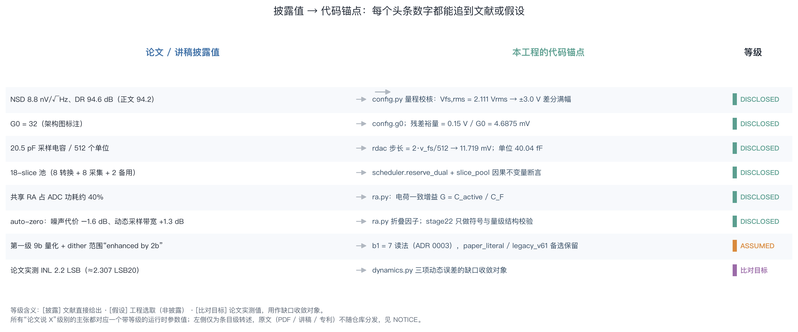

*Figure 5: every headline number of the paper/slides lands on a graded code anchor.*

| Disclosed value (`[00]` / `[00_1]`) | Code anchor | Grade |
|:---|:---|:---|
| NSD 8.8 nV/rtHz, DR 94.6 dB (text 94.2) | `config.py` range check: Vfs,rms = 2.111 Vrms -> +/-3.0 V differential full scale | `[disclosed]` |
| G0 = 32 (figure annotation) | `config.g0`; residue headroom = 0.15 V / G0 = **4.6875 mV** | `[disclosed]` |
| 20.5 pF sampling capacitance / 512 units | `step = 2*v_fs/512` -> 11.719 mV; unit 40.04 fF | `[disclosed-inferred]` |
| 18-slice pool (8 + 8 + 2) | `scheduler.reserve_dual` plus `slice_pool` causal invariant assertions | `[disclosed]` |
| Shared RA ~40% of ADC power; auto-zero -1.6 dB noise, +1.3 dB dynamic bandwidth | `ra.py` folding factors; stage22 checks only the **structural** sign and magnitude | `[disclosed]` (coefficients) |
| First-stage "9b quantization" + dither range "enhanced by 2b" | `b1 = 7` reading (ADR 0003), both alternative readings retained | `[assumed]` (reading) |
| Measured INL 2.2 LSB (~2.307 LSB20) | The gap that `dynamics.py` must converge toward | comparison target |

> The 4.6875 mV residue headroom is a **derived value under the current model range and gain
> configuration** (0.15 V / G0=32), not a fixed tolerance disclosed by any patent.

### 4.5 Explicitly **not** implemented

| Item | Status | Note |
|:---|:---|:---|
| Acquisition-window comparison experiment | `NOT_RUN` | Only a first-order scaling law exists today |
| Bit-by-bit large-DAC vs direct RDAC final-state comparison | `NOT_RUN` | Direct final state is implied by top-plate hold; the comparison is not built |
| Dielectric-absorption multi-time-constant memory error model | `NOT_RUN` | A tracking-causality test **cannot** substitute for it |
| Phase-level auto-zero noise transfer (`C_AZ` store/release, wide/narrow switching) | `NOT_RUN` | Budget multipliers only, not phase-level transfer |
| SPICE/Spectre small-scale benches | `BLOCKED` | With no PDK/SPICE licence the project ships a runnable interface plus a `NOT_RUN` marker; it does **not** fake tool runs |
| MC yield confidence intervals and sample-size convergence | `NOT_RUN` | Low-frequency observation length is covered; yield statistics are not |
| Circuit-level reference-buffer solve | not done | Loading is linearised at nominal rail voltages |

---

## 5. Parameter provenance

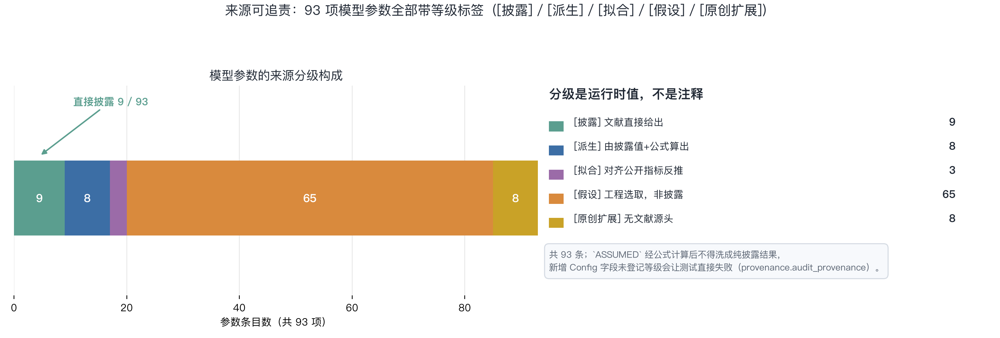

*Figure 6: the runtime composition of `provenance.PARAM_GRADES` (the figure reads that ledger
directly; nothing is hard-coded).*

Grading is a **runtime value**, enforced by `provenance.audit_provenance`:

| Grade | Meaning | Count |
|:---|:---|---:|
| `[disclosed]` DISCLOSED | Directly given by the literature | 9 |
| `[derived]` DERIVED | Computed from disclosed values | 8 |
| `[fitted]` FITTED | Back-fitted to match published metrics | 3 |
| `[assumed]` ASSUMED | Engineering choice, not disclosed | 65 |
| `[research extension]` | No literature source (original work by this project's authors) | 8 |

**This is why the model can be read sceptically**: only 9 of 93 parameters come straight from
the literature while 65 are engineering assumptions. The rule is that an `[assumed]` value
computed through a formula **must not** be laundered into a purely disclosed result, and every
headline number traces to a specific line.

---

## 6. Verification methodology

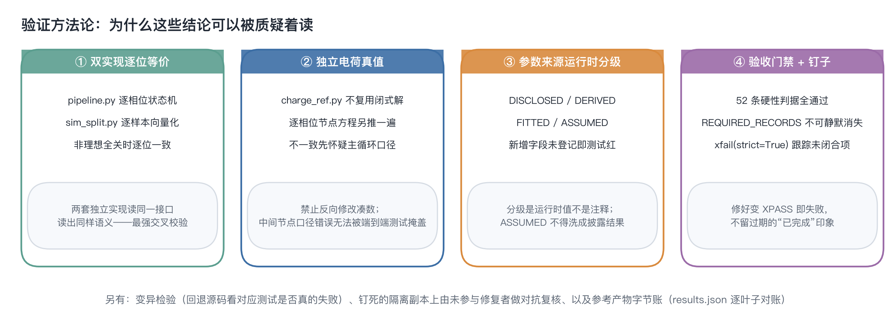

*Figure 7: making "the conclusion is trustworthy" itself testable.*

| Line of defence | Practice | Why it works |
|:---|:---|:---|
| Dual-implementation equality | `pipeline.py` (per-phase state machine) and `sim_split.py` (vectorised) agree bit for bit with all non-idealities off | Two independent implementations reading the same interface is the strongest cross-check available |
| Independent charge truth | `charge_ref.py` re-derives the node equations per phase **without** reusing the closed form; on a mismatch the main loop is suspected first | A wrong intermediate convention is invisible to end-to-end tests (the core lesson of the v5 audit) |
| Runtime grading | A new `Config` field without a grade turns the suite red | Turns "grading in a comment" into an unbypassable assertion |
| Acceptance gates | 52 hard criteria plus 28 unconditional required records; `xfail(strict=True)` tracks open items | Acceptance items cannot silently disappear; fixing one fails the test until the marker is removed |
| Byte accounting | Reference `results.json` reconciled leaf by leaf, recording what changed and why | Numerical changes must be explained, never masked by relaxing a threshold |
| Adversarial review | Falsification plus mutation testing by someone who did not write the code, on a pinned isolated copy | Whether a reverted source change actually fails a test decides whether the test has teeth |

---

## 7. Results at a glance

### v8.x evolution

v8.0.0 integrates the physical slice pool, interleave pretracking, auxiliary input, coupled
reference/RA/ADC2 dynamics and the fixed-point digital core into the main path. 8.1.0 adds the
digital-side fixed-point RTL (P0-P3): a synthesizable calibration core, dual SAR with a shared
3-bit Flash, 18-slice scheduling, Verilator simulation and mutation-testing gates - with
behavioural `results.json` byte-identical to v8.0.0.

8.2.0 fixes two statistical-integrity defects and hardens the entry guards. (i) The MC loops
shared one integer seed between the mismatch draw and the noise realisation, so the two streams
drew the same values (probe-verified: the stream coincided, the per-chip spread did not
collapse); mismatch and noise now use independent `SeedSequence.spawn` streams. (ii) The unit
crosstalk activity is now A(k)/2 consistently with `_dem_fluctuation`. The reference output was
regenerated and reconciled leaf by leaf: **878 of 926 leaves are byte-identical and all 48
changed leaves sit in RNG-dependent sections** (`mc`, `mc_cal_*`, `mc_pdk_*`, `budget`, `s13`).

> **The numerical deltas cannot be attributed to the fix.** A bootstrap test on the per-chip
> SNDR (20,000 resamples) puts **all 10 statistics - delta-worst-chip and delta-sigma across 5
> sections - inside the 95% null band** (|z| <= 1.44). At n=16 / n=60 the MC and yield metrics
> are sampling-noise dominated, so the v8.1.0 and v8.2.0 MC conclusions **do not contradict
> each other**. **Do not** read the MC extremes of this model as yield claims.

8.2.1 closes an entire **class** of defects exposed by an independent adversarial re-review of
v8.2.0: domain-validation predicates checked only the sign or the range and forgot finiteness, so
`nan` / `+/-inf` slipped through and propagated silently. 32 predicate lines across 13 source and
tool files were hardened.

8.2.2 is a forward-only patch that **fixes v8.2.1's red CI**. The root cause is not a version but
the **BLAS backend**: in `fit_unit_weights` the arithmetic between `svd()` and the weight guard is
unguarded, so a non-finite factor makes a zero entry of `design` multiply a non-finite entry of
`theta` - i.e. `0 * inf`, an invalid floating-point operation; x86-64 OpenBLAS raises
`RuntimeWarning`, Apple Accelerate does not, hence green locally and red on CI. Two gates were
added: an SVD-factor gate (before any arithmetic and before the rank comparison) and an entry
gate on the spec's physical scales.

> **No reference output changed.** The three fingerprints (v8.2.0 / v8.2.1 / v8.2.2) are
> **character-identical** and all 926 leaves byte-identical. CI went from four failing Python
> versions to **9/9 jobs green**.

Byte accounting and the significance test are in the [CHANGELOG](CHANGELOG.md); the v8.2.0
charts are in [docs/release_v8.2.0](docs/release_v8.2.0/), the v8.2.1 hardening census in
[docs/release_v8.2.1](docs/release_v8.2.1/), and the v8.2.2 ingress-closure comparison in
[docs/release_v8.2.2](docs/release_v8.2.2/).

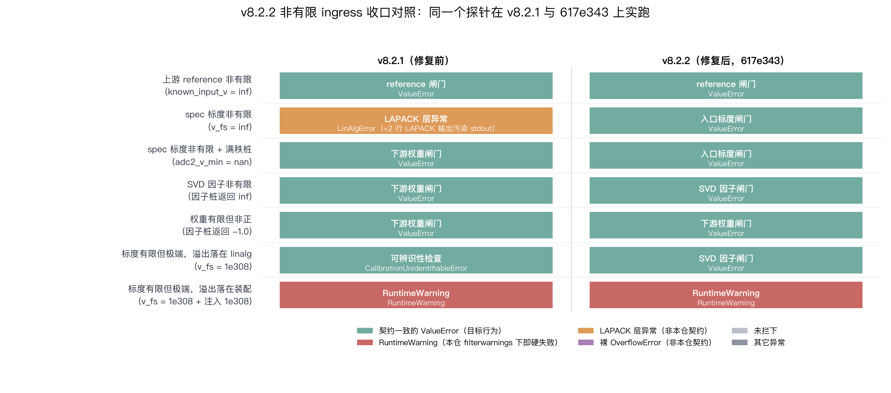

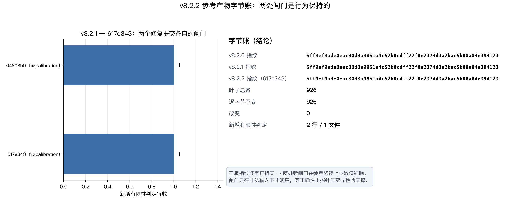

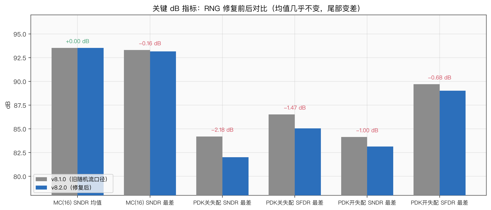

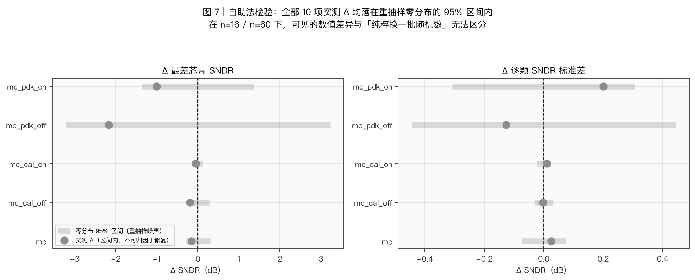

A leaf-by-leaf diff of `results.json` against the v7.0.10 aggregate baseline shows **516 of 626
shared metrics exactly identical**, 40 at float-noise level (<1e-6 relative) and **70 genuinely
changed** - all in subsystems newly covered by the physical main path (see the byte accounting in
the [CHANGELOG](CHANGELOG.md)):


Headline numbers (`paper_literal` main configuration, all traceable in
`tools/results/results.json`): ENOB 20.58 bit, SNDR/SFDR 125.6/155.5 dB (ideal no-mismatch
path), output noise rms about 1.0 uV, DEM-on/off SNDR 93.4/93.5 dB, worst-case MC SNDR/SFDR
82.0/85.1 dB, post-calibration noise-floor ratio 1.006.

Verification figures (generated by `tools/run_all.py` and `tools/make_readme_compare.py`,
refreshed together with `results.json`):

| | |
|:---|:---|
|  |  |
| *Segmented-DAC static errors, topology comparison, INL contributions* | *DEM on/off spectrum: unary permutation pushes mismatch spurs to the floor* |
|  |  |
| *Physical-pool calibration: noisy training, frozen weights, held-out validation* | *KTC observed-noise reduction: scaled-capacitor trade-off* |
|  |  |
| *Mismatch stress sweep* | *Noise/mismatch error budget* |
|  |  |
| *Parameter sweeps and feasibility region* | *Segmented sub-DAC signal chain* |

---

## 8. Install and minimal run

Python 3.10-3.13; runtime dependencies are NumPy, SciPy and Matplotlib. A virtual environment is
recommended.

```bash
python3 -m venv .venv
source .venv/bin/activate
python -m pip install -e '.[dev]'
```

```python
import numpy as np
from adi_model import Config, sine_input
from adi_model.pipeline import run_pipeline
from adi_model.metrics import sine_fit_metrics

cfg = Config.paper_literal(dither_mode="off")
n = 16384
fin = cfg.fs * 307 / n
result = run_pipeline(cfg, sine_input(2.1, fin), n)
words = result.to_codes()
metrics = sine_fit_metrics(words.voltage, cfg.fs, fin)
print("analog overflow:", np.count_nonzero(words.analog_overflow))
print("output clipping:", np.count_nonzero(words.clipped_low | words.clipped_high))
```

`result.out` remains a floating diagnostic. `to_codes()` uses raw backend codes, digital
switching and nominal/frozen weights with Q30/Q32 coefficients, checked 96-bit accumulation and
20-bit offset-binary words. Analog overflow and final range clipping remain separate. The
unquantized research KTC observer is outside this integer interface.

`run_with_split_calibration` retains requested noise during controlled static training, rejects
deficient rank, freezes coefficients and validates with an independent waveform/noise sequence on
the same physical chip. The full sweep checks two chips and two training sizes using final integer
words.

---

## 9. Standard verification commands

```bash
ruff check .
ruff format --check .
mypy
pytest -q --cov
adi-run-all --results-dir ./output/verification
adi-make-report --results-dir ./output/verification
```

The full sweep covers legacy mechanism baselines, the new physical reference/RA checks, a 64-second
slow-noise state, two complete chips at two training sizes and independent fixed-point validation.
Gates check specific required records, minimum counts and failure records, and exit non-zero on
failure. `results.json` is standard UTF-8 JSON; quantities that cannot be defined are recorded as
null with their field paths, and NaN/Infinity are never written. HTML reports are generated from
actual results and separate architectures/sources and their applicability.

Repeated sweeps in one software environment must be byte-identical; cross-NumPy/SciPy/BLAS
comparisons use numerical tolerances. CI covers Python 3.10-3.13, the 3.12 full sweep, independent
double-run determinism, RTL simulation, and build artefacts (wheel imported outside the checkout
plus its CLI).

---

## 10. Simulation order

1. **Static charge and range**: with noise/dynamics off, check all coarse carries and RDAC/RA/ADC2
   overflow; confirm the selected 7/9-bit architecture.
2. **Independent physical implementation**: fix the fabrication seed, verify actual slices,
   capacitors, DEM and dither masks; keep physical parameters when reusing a chip and pass runtime
   configuration explicitly.
3. **Noise and calibration**: complete the rank/conditioning checks first, then compare training
   size against independent validation; retain drive/reference error and residual mismatch.
4. **Joint dynamics**: introduce shared `Rs`, `Ron`, coarse/fine reference, RA
   bandwidth/slew/swing and ADC2 wide/narrow sampling individually, then combined; add time-step
   convergence checks.
5. **Final integer words**: measure SNDR/SFDR and overflow of the final code stream; report static
   mean error, local carry scans and full code-density INL/DNL separately.
6. **Circuit hand-off**: write real Spectre sub-block specifications with acceptable behavioural
   parameter ranges, then replace assumptions with circuit simulation.

---

## 11. Sources and limits

| Item | Current caveat |
|---|---|
| Paper `[00]` | 94.2 dB DR, 9.3 nV/rtHz; kept as a separate record |
| Slides `[00_1]` | 94.6 dB DR, 8.8 nV/rtHz, about 40 Hz corner; separate record |
| RA noise | Inferable from the chosen DR anchor; it is a fit, not a performance prediction |
| Reference loading | Real signed charge linearised at nominal rail voltages; peak droop states the validity domain |
| RA/ADC2 dynamics | Finite signal response is modelled; no claim of complete switched noise transfer |
| Low-frequency noise | Stationary slow state with an explicit low cutoff; the 64 s sparse observation preserves the 40 MHz physical clock |
| 20-bit output | Real checked integer reconstruction; not equivalent to 20 ENOB or a full code-density proof |
| KTC observer | Research extension, off by default; the unquantized observer path does not enter the integer interface |
| PDK / yield / power | No device or layout evidence; no silicon-level predictions |

**Registered but not addressed in this release** (details and measured evidence in the
[CHANGELOG](CHANGELOG.md)):

- Input gates guarantee a finite **input**, not finite intermediates - a finite but extreme input
  can still overflow during matrix assembly;
- `CalibrationSpec` integer fields are not type/integrality checked;
- `charge_ref.py` has no domain guards at all (a "missing guard" problem of a different class);
- the fixed-point deserialisation path does not go through `validate()`.

Formulas, input/output units and test bases are in the [ADR directory](docs/adr/) (0001-0018) and
the [modelling guide](docs/behavioral-closure.md). Historical audit/report documents are retained
as version evidence; current capability is defined by [model_scope.md](docs/model_scope.md) and
[IMPLEMENTATION_CHECKPOINT.md](docs/IMPLEMENTATION_CHECKPOINT.md).

---

## 12. Repository layout

| Location | Responsibility |
|---|---|
| `src/adi_model/config.py` | Configuration, legality, derived quantities, source grading |
| `slice_pool.py`, `timing.py`, `pipeline_engine.py` | Physical instances, causal scheduling, main signal chain |
| `input_network.py`, `pretracking.py` | Shared input network and digital availability |
| `reference_charge.py`, `conversion.py` | Signed charge and joint conversion dynamics |
| `weight_calibration.py`, `fixed_point.py` | Identifiable training, frozen coefficients, integer reconstruction |
| `metrics.py`, `low_frequency_noise.py` | Spectral conventions and slow state |
| `closure_experiments.py`, `acceptance.py` | Independent verification protocols and required records |
| `serialization.py`, `reporting.py` | Standard data artefacts and reports |
| `rtl/`, `synth/`, `sim/` | Fixed-point RTL, DC synthesis flow, simulation vectors and testbenches |
| `tools/`, `tests/`, `docs/adr/` | Full pipeline, regression suite, traceable design decisions |
| `mechanism_inventory.json`, `sources_manifest.json` | Machine-readable mechanism/source/status ledger and hashes |

Run the full verification before contributing, and state data conventions, assumptions and error
sources. Changes to the physical model must add verification capable of independently refuting the
implementation; historical numerical changes must be explained rather than masked by relaxing a
threshold.

---

## 13. Citation

If this model helps your work, please cite it - the citation records the version, which is how
your numbers become reproducible.

```bibtex
@software{zhao_2026_sar_adc_behaviour_model,
  author    = {Zhao, Reed},
  title     = {20-bit SAR ADC Behavioural Verification Model},
  version   = {8.2.2},
  year      = {2026},
  publisher = {GitHub},
  url       = {https://github.com/defineiocc02/20bit_SAR_ADC_Behaviour_Verification},
  license   = {BSD-3-Clause},
  note      = { Independent academic behavioural model; not affiliated with,
                endorsed by or licensed from Analog Devices, Inc. }
}
```

Machine-readable metadata for GitHub's *Cite this repository* button is in
[`CITATION.cff`](CITATION.cff). **Please also cite the modelled architecture itself** (see `[00]`
in [section 14](#14-references)) - this repository is a study of that work, not a replacement.

---

## 14. References

| ID | Reference |
|:---|:---|
| `[00]` | R. Bodnar et al., "A 9.3 nV/rtHz 20 b 40 MS/s 94.2 dB DR Signal-Chain Friendly Precision SAR Converter", **ISSCC 2024**, Session 9.8, pp. 182-183. DOI: `10.1109/ISSCC49657.2024.10454329` |
| `[00_1]` | Presentation slides of the same work (cited page by page) |
| `[09]`-`[14]` | Patent family covering quantizer/RDAC separation, sampling-side dither, DEM ordering, interleaving, auxiliary input charge and low-power reference |

Parameter-level citations live in `provenance.PARAM_GRADES`, one parameter per line. The complete
list of third-party references (including background architectures that are **not** part of the
target device) is in [`NOTICE`](NOTICE).

---

## 15. License and declarations

**Code licence: BSD-3-Clause, see [`LICENSE`](LICENSE).** You may use, modify and redistribute
this software, including commercially, subject to the three BSD conditions: retain the copyright
notice, reproduce it in binary distributions, and do not use the author's name to endorse
derivatives.

- **Independence.** This is an **independent academic behavioural model** with **no affiliation,
  endorsement, sponsorship or licence** from **Analog Devices, Inc.** "Analog Devices", "ADI" and
  "LTC" are trademarks of Analog Devices, Inc.; their appearance here is **nominal use** to
  identify the published literature under study and implies no endorsement.
- **What is used.** Only **public** material: the ISSCC 2024 paper and slides, published patents
  and public datasheets - all listed in [`NOTICE`](NOTICE) and **none of them redistributed here**.
  No silicon, netlist, layout, PDK, design database, internal document or non-public information is
  used.
- **No patent licence, no warranty.** Nothing here grants any licence under any third-party patent
  or other intellectual-property right. Patents in `NOTICE` are cited as **mechanism references**;
  the embodiments they describe are **not** the implementation released here. The software is
  provided **"AS IS"** without warranty of any kind, and is a **research model**, **not** a
  sign-off tool: it **must not** be used for production, safety-critical or yield decisions.
- **Original contributions.** The **KTC noise-cancellation branch** (`adi_model/ktc.py`) is an
  **original research extension** by this repository's authors, graded `RESEARCH_EXTENSION` and off
  by default; it is **not** a feature disclosed in `[00]` or patents `[09]`-`[14]`. **Do not
  attribute it to Analog Devices.** Likewise, Figures 1-7 in this README (and `docs/readme/`) are
  redrawn from the published **textual** description and do **not** copy any third-party figure.
- **Objections.** If you believe you own rights to any content and that attribution is wrong or out
  of scope, please open a
  [confidential security advisory](https://github.com/defineiocc02/20bit_SAR_ADC_Behaviour_Verification/security/advisories)
  or see [`SECURITY.md`](SECURITY.md). Attribution and licence corrections are handled at the
  **highest priority**.

The full Chinese declaration is in [README.md](README.md) section 15.
