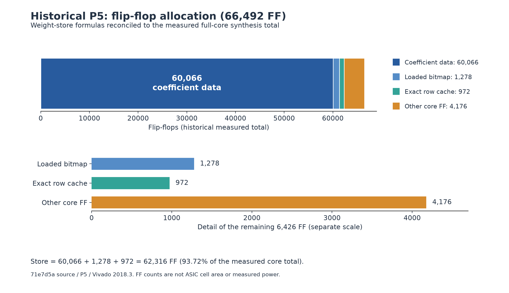
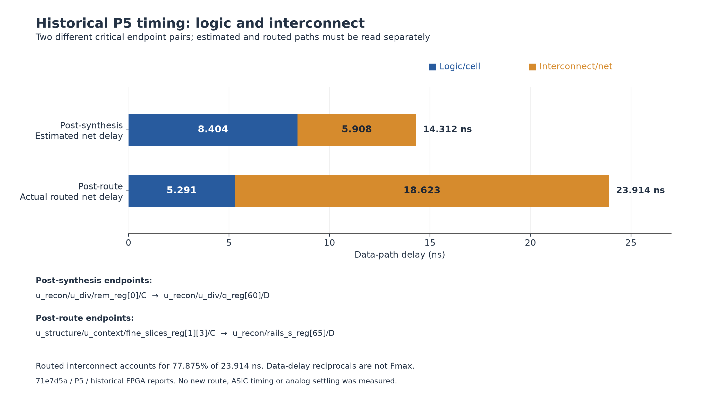
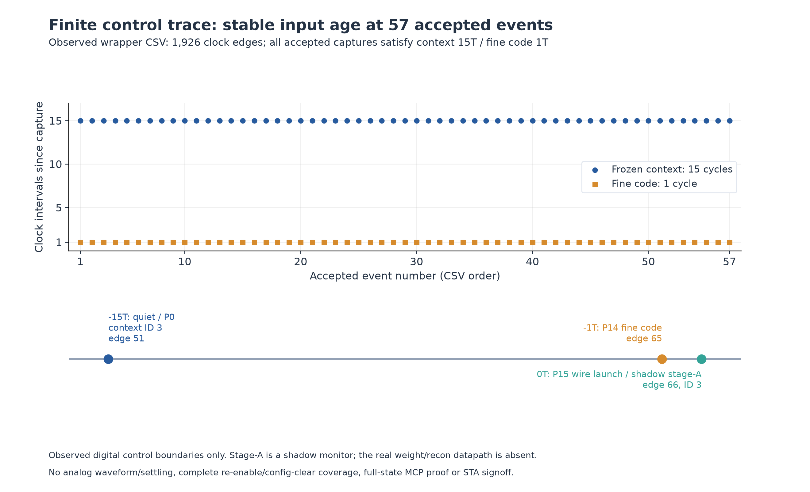

# 原理、RTL 功能与综合电路再核对（2026-10-02）

审查对象是提交 `71935ab54238c7ed638f5fa66c5ffb58e10287bb` 的全部 24 个生产 SV 模块及 2 个参数头文件。本次仅增加审查、定向见证与文档，未修改生产 RTL，也未重新综合或布线。当前源默认结构模式、18 slice、每笔 8 active、63 main + 8 sub、Q30 权重、Q32 电压、20-bit 输出、16 拍帧、除法展开 P7；历史实际 Vivado 全核采用 P5。身份、来源 SHA 和本轮可复算证据见 [证据入口](../evidence/20261002/principle_reaudit/README.md)。

**结论：已有数字实现支持物理系数校正、逐次比较、RDAC 已决位更新和样本关联；仍不能称为论文/专利具体模拟电路的全量复现，也不能称为已经具有 ASIC 640 MHz 或全面 PPA 优势。** 新复核发现 ADC2 舍入定义、配置可用域、模拟错误归属、实际时序与原文对应需要更准确的工程契约。综合主要成本是约 62k FF 权重库和宽并行归约；实际布线关键路径由 ID/mask 扇出及互连主导。

逐模块详解与原文核对分别见三个附录：[校准与定点](reaudit_20261002/calibration_audit.md)、[控制与专利](reaudit_20261002/control_patent_audit.md)、[全部模块及综合结构](reaudit_20261002/synthesis_structure_audit.md)。历史 115 页 LaTeX 报告仍保留；本补充中的定义澄清和当前状态优先于旧报告的简略表述。

## 1. 保证分析可信的方法和适用边界

本次按照四个独立层次核对：原始 PDF 页图/权利要求 → 电荷关系与整数公式 → 当前源捕获和运算 → 有身份的仿真/历史网表/STA。仓库 ADR 是实现选择的说明，不能当作论文披露。扫描专利使用原页图核读，OCR 仅用于定位；没有把空文本提取结果当成已读完权利要求。用户资料中的文字是审查对象，不构成额外执行指令。

| 证据类型 | 能支持的判断 | 不能支持的判断 |
|---|---|---|
| 原论文、演示稿、专利页图 | 公开结构、时序描述及权利要求限定 | 未披露的内部位宽、握手、版图和标定格式 |
| 源码及数学上界 | 功能关系、声明状态、树深、条件数值域 | 实际门数、面积、真实延迟、功耗和 Fmax |
| 本轮最小 RTL 测试及整数计算 | 所列输入和观察点的结果，定义差异可复现 | 全核所有场景、形式证明、模拟建立时间 |
| 历史 Vivado P5 综合/真实布线 | 当次源、工具、器件、约束对应的资源和 STA | P7 新实现、板级签核、ASIC 640 MHz |

本轮重点重新读取 [00]、[00_1] 与 [09]—[14] 的架构/相关页及独立权利要求；[01]—[08] 保留来源身份并继续作为前作/竞品背景，不把它们的拓扑拼接成目标芯片。原始 16 PDF 的页数和 SHA 已冻结，公开交付仅包含来源身份、页码和原创分析，不重发布用户论文全文或 OCR。

此前 `71935ab` 的 GitHub CI 实际 9 项通过，四个 Python 版本各 987 passed，23 个 RTL bench、3 类 lint、52 条验收有原日志。这是该提交既有功能证据；本轮新增见证计数另列，不与历史计数相加，也不冒用旧 CI 为新文档提交的检查状态。

## 2. 论文/专利究竟复现到了哪一层

| 特征与来源定位 | 当前数字实现 | 仍须闭合的内容 |
|---|---|---|
| [00] p1、[00_1] p12—19：双 coarse 量化器、共享 3-bit Flash、9-bit coarse | 两个 `sar_trial_ctrl`，共享 `sadc_enc` 的 7 比较器输入，Flash seed 固定高 3 位 | 论文未披露同步逐拍握手；Flash 阈值误差、bubble、跨 seed 区间纠错和比较器延迟需宏契约 |
| [00] p1/p2、[00_1] p19：18 slice，8 转换/8 采样/2 备用 | `slice_pool_ctrl` 保留上一 acquiring 为本次 converting，补集挑下一组 | 随机游标扫描不等于所有 8/18 组合均匀抽样；实际输入完整采集时间尚有差距 |
| [00_1] p18；[09] p32—33：qDAC/rDAC 分离，RDAC 跟随已决位 | `trial_code`/`resolved_code` 分离，`coarse_update` 后才装载 RDAC | 连续模拟电荷、冗余 DAC 结构和残差放大电路不在 RTL |
| [00] p1、[00_1] p17—18；[10] p35—36：采样/量化相关 dither | 采样 mask/rail、PRNG、RDAC coarse+dither、重构减已知电荷 | 论文所述 lower/upper 双分量及量化器/RDAC 不同注入节点、量化器结果转入 RDAC 时 dither 范围扩展 2 位未完整实现；不能用 sampling dither 代替全部结构 |
| [00_1] p27—30；[11] p46—47：二维单位 DEM 和 slice 轮换 | bank 独立 9-bit sid，二维缺角主阵列与 sub 排列，物理权重查表 | 几何 63+8 是工程候选，不是已公开版图；频谱收益须真实失配/settling 模型 |
| [12] p12—13：跨 ADC 最新结果跟踪/预加载 | 有交替工作和共享 Flash | 最新另一路结果的 preload/tracking 流程缺失；交织本身不足以满足全部限定 |
| [00_1] p21—22；[13] p16—17：AUX 预充、保持低电荷输入扰动 | `aux_charge_enable`、hold-low 和 acquisition/conversion mask | AUX 来源、阻抗、开关、初态及电荷路径需模拟宏；数字边界不能证明低 kickback |
| [00_1] p24—26（参考）、p34—35（RA/AZ）；[14] p23—24：粗局部参考→精确参考、RA、AZ | 注册参考/RA/AZ enable 和死区 | GMR、OTA、非交叠、外部参考瞬态、电荷补偿及增益非线性未物理实现 |
| [00_1] p35：ADC2 采样宽带建立/窄带降噪 | `fine_acquire_enable` 表达采集窗 | 未显式表达两档 BW 选择，必须由 ADC2 模拟宏内部实现并验证 |
| [00] p1：外部导出 DAC 系数，片上数字校正 | 1278 个可加载物理系数，offset/range/injection、整数重构 | RTL 不包含自动辨识系数的学习引擎；12-bit ADC2、Q30/Q32、63+8 分段都是工程选择 |

**来源编号有一处需订正说明：** [00] PDF p3 把引用 [12] 印为 `10,797,889`；用户附件是 `10,707,889 B1`。后者的标题/作者及跟踪方法与附件相符，前者公开记录是 Apple 的另一项 DLOA 专利。这是疑似原文书目笔误，不能默默声称编号一致。分析按实际附件 [US10707889B1 原始公开记录](https://patents.google.com/patent/US10707889B1/en) 定位，另号见 [US10797889B2 记录](https://patents.google.com/patent/US10797889B2/en)。专利对照是技术结构分析，不是法律范围或许可结论。

不能把所有专利实施例并在一起当作论文芯片的唯一电路；应先按芯片架构选定必要特征，再定义可测的宏端口与行为。上述缺口有些是原先已记录的范围边界，本轮不是把它们重新包装成新发现的 RTL bug。

## 3. 数字校正公式：对的部分、工程假设和新增定义问题

### 3.1 电荷与系数的语义

归一化输入为 x，物理单元有效权重为 w（含 C/Cf、桥接衰减及约定的残差增益），采样参与 a∈{0,1}，已知开关电荷为 s，公共注入 I，后级观察 F，偏移 O。在线性、稳定、参数一致的模型中：

$$F=O+\sum w(a x+s+I)=O+Gx+R+TI,$$
$$T=\sum w,\quad G=\sum wa,\quad R=T-2\sum w\,on+\sum w\,r.$$

所以 x=(F−O−R−TI)/G。该公式是由工程定义下的电荷守恒得到，不是论文逐字给出的定点实现。系数已经包含 C/Cf/等效增益，不能再无条件乘或除论文 RA≈32。真实 RA 动态增益、非线性、记忆效应、参考扰动、输入相关 charge injection 不会因为静态 w、O、I 而自动被完全校准。

当前 `cal_weight_reduce` 按物理 ID 和实际 DEM 后开关状态求和，采样 dither 单元从 G 中扣除但保留在 T/R 中；`cal_sample_context` 冻结已发生的物理决策。若错误地用 live DEM、最新 RDAC 码或把所有 dither 单元继续算输入增益，即便与一个同错模型比较也可错误“通过”。本轮没有发现默认配置这几处重新发生该错误。

### 3.2 精确整数重构与 floor

W_Q=round(w·2^30)，F_Q/O_Q/I_Q 使用 Q32，T_Q/G_Q/R_Q 仍为权重尺度。RTL 构造：

$$N=(F_Q-O_Q)2^{30}-R_Q2^{32}-T_Q I_Q,$$
$$S=(N+G_Q2^{32})2^{20},\quad A_1=\lfloor S/2^{33}\rfloor,$$
$$q=\lfloor A_1/G_Q\rfloor,\quad word=clip_{[0,2^{20}-1]}(q).$$

G_Q>0 时，嵌套 floor 与直接 floor(S/(2^33 G_Q)) 相同。这并不许可用向零截断替代负数 floor。`div_floor` 使用幅值 restoring division，负数有非零 remainder 时作 −(quotient+1)，保留最负数、宽分母分类和末组 padding 的契约。本轮 5,000 个整数计算核对嵌套 floor；186,744 项小位宽 grouped-divider 计算对照任意精度 floor，均一致。后者是独立算法计算，**不是本轮 186,744 项 RTL 仿真或形式穷举**。

### 3.3 新澄清：ADC2 是“增量 RTE”，不是所有情况下的“绝对中心 RTE”

当前 `adc2_dec:91—99` 和冻结 Python 契约实现：

$$F_Q=min_Q+RTE\{(2c+1)(max_Q-min_Q)/2^{P+1}\}.$$

它不是先加 min_Q 再对整体码仓中心 RTE。RTE 在整数平移为奇数、恰好半值时不保持同样偶数选择。例如 P=12、min_Q=1、max_Q=4097：c=0 的准确中心为 1.5，绝对中心 RTE 是 2，当前结果为 1；c=1 的中心 2.5，绝对中心 RTE 是 2，当前结果为 3。

本轮 ADC2 实例 9 个测试全部匹配已冻结的增量契约，其中 6 例与绝对中心 RTE 相差 ±1 个 **Q32 整数 LSB**。另用有理数对照六组范围的 24,576 个码，冻结契约全部匹配，8,192 例与绝对中心 RTE 不同。不能把这个差异写成“RTL 与其软件 oracle 不一致”。应在下一次契约版本明确选择哪种语义，再同时更新参考、RTL 和兼容验收。

在归一化 G=32 下，这个 ±1 Q32 LSB 对最终 20-bit 未量化码的影响是 ±2^-18 输出 LSB；靠近最终 floor 阈值仍可能改变最终一个码，不能说“始终无影响”。本轮保持生产语义，避免为了名词澄清而未经完整回归改变已冻结整数接口。

### 3.4 新澄清：cfg_ready 不等于满量程数值保证

`calib_regs` 检查标量完整、权重 loaded、合法范围及原子 validate；它没有证明所有合法系数、offset/injection 组合都落在 MAC 的有效数值域。`cal_residue_mac:62—87` 对输入项、num、分母及 shifted 范围作显式守卫，MAC 仅生成 A1/any_ovf；失败后的完成事件、ID/flags 与保留最后合法 word 由 recon_core/cal_output_stage 实现，这是可见错误处理，不是静默绕回。

以理想无注入、R=0 为例：x=0 时 S=G_Q·2^52，正上界要求 G_Q<2^43；x=+1 时 S=G_Q·2^53，要求 G_Q<2^42。**这是严格小于；等号已溢出。** 本轮 MAC 实例实际验证 G_Q=2^43−1/2^43 及 2^42−1/2^42 的边界。标准物理 G≈32 时 G_Q=34,359,738,368，远低于这些界限。

另将一份正常 1278 系数镜像整体放大 2^20：每个最大系数仍为 2^46<2^47、整表和也合法，却令所选 G_Q=36,028,797,018,963,968；MAC 在同样 midscale 条件下报 acc_ovf。系数合法性是独立装载谓词/完整镜像计算，溢出是实际 MAC RTL 见证；**没有把它描述成完整顶层 validate/输出仿真**。

改进应在离线导出/配置工具建立实用域检查：统一物理单位、确认正常 G 下界/上界、ADC2 min/max、offset 与 injection 区间，界定允许的全输入与 rails 场景；生成有版本的配置证书和回读摘要。若要改硬件 cfg_ready 判据，需另定义运行合法配置兼容策略和成本，不能只增加一个随意 gain 常数。

### 3.5 能否减少位宽：先建立精度预算

若真实关系 F−O=Σw(ax+s+I)，用 w+δw 重构且 F/O/I 准确，则：

$$\hat{x}-x=-\sum\delta w(ax+s+I)/\hat{G}.$$

附加物理条件 N≤568、nearest-Q30 的 |δw|≤2^-31、|ax+s|≤2、I=0、Ĝ≥32，可得 20-bit 未量化误差上界 0.008667 LSB；Q26 为 0.138672 LSB，Q22 为 2.21875 LSB。它们是**带条件的最坏界**，不是当前所有 cfg_ready 配置的证明，也不覆盖 RA 非线性、系数估计误差或 floor 阈值后的最终代码保证。名义 sampling 模式的 G 约为 31.75，Q30 条件界相应为 0.00873524 LSB，不能直接套用 G≥32。位宽降低必须同时改量纲、缩放、范围守卫、配置格式与参考，并以全域误差/INL/频谱和同约束 PPA 验证。

论文 20-bit 是输出精度定位，不能当成 20-bit ENOB。若仅作一阶一致性估算，6 Vpp 满量程的 20-bit LSB≈5.722 µV；把 9.3 nV/√Hz 假设为覆盖 20 MHz 的平坦输入噪声，则 rms≈41.59 µV、满量程正弦 SNR≈94.15 dB。这与论文 DR 的量级相容，但其噪声带宽/差分定义、失真和实测滤波并未由 RTL 建立，不能据此宣称已达论文 DR。

## 4. 实际时序必须与原文逐项对齐

源码判断使用 **边沿前 phase**，注册 enable 在该沿之后生效。`recon_start` 是 phase15 的 continuous wire；`recon_core:250` 在同一沿直接接受，不能套用“注册 start 下一拍才捕获”的描述。

| 源码正常时序关系 | 完整时钟间隔 | 640 MHz 理想预算换算 | 分析边界 |
|---|---:|---:|---|
| coarse start（pre1）→done 在 pre7 的 NBA 生效 | 6T | 9.375 ns | 与论文约 7 ns 的 coarse 转换不等同 |
| coarse start→最后 RDAC load（pre8） | 7T | 10.9375 ns | RDAC 已决码再延迟一沿装载 |
| TP 下降（pre15→post0）→coarse start（pre1） | 2T | 3.125 ns | 不能证明共享 Flash 在论文 <1 ns 返回采集 |
| 新 acquiring 开始（pre1→post2）→下一 TP 下降 | 14T | 21.875 ns | 16T=25 ns 帧周期不自动等于单 slice 完整采集时间 |
| 最后 RDAC pre8→准确参考/RA pre9 后启用 | 1T | 1.5625 ns | 数字间隔，不是已测模拟建立裕量 |
| RA/参考打开→下一 TP 下降 / quiet 数字沿 | 6T / 7T | 9.375 / 10.9375 ns | 两个观察点不能混用；宏 settling/ADC2 sampling 仍需定义 |
| 前代 context 在 quiet pre0 更新→stage A pre15 | 15T | 23.4375 ns | 只可作为精确 MCP 候选的一项条件 |
| fine code 在 pre14 更新→stage A pre15 | 1T | 1.5625 ns | 不能随 context 一起放宽为 15/16 周期 |

本轮正常/丢帧协议 wrapper 实际跑 120 帧，57 launch、63 drop、1,920 项原协议检查，另保存 1,926 沿 CSV；57 笔被接受事务的 context-age=15T、fine-code-age=1T 均成立。wrapper 的 stage A 是观察用影子 FF，未例化实际 weight/recon 数据通路；没有覆盖重新 enable 或完整 cfg-clear，也没有形式证明全部合法序列。上述 ns 是把逻辑间隔乘目标 1.5625 ns 的预算换算，**不是 640 MHz STA 或模拟延迟测量**。

因此若目标是纸面结构忠实复现，应为模拟宏建立 bit decision 最迟/最早、Flash seed 错误范围、RDAC 更新与 RA 可用间隔、采样 aperture、AZ/nonoverlap、双 BW 切换、故障保持窗的统一时序表。保持 16 拍吞吐不要求所有模拟动作必须由统一 640 MHz 同步六步控制完成；但改变 coarse 控制协议是另一个架构候选，必须保持可验证的数字边界并重新仿真/综合。

### 模拟错误的归属也有明确限制

`current_bad` 在 residue_capture 冻结，`analog_bad` 在下一 quiet 转交时冻结，顶层只在 recon launch 时将该 packet 的 bad 写 sticky。16 项定向检查显示：未 launch 就取消/替换的 bad packet 可以不留下 sticky。这符合当前“launch 时诊断”契约，但不适合被描述为“全部模拟故障按样本 ID 可追溯”；result_flags 的五位也不含独立模拟 bad 标志。adc2_over 等外部模拟回读若不保持至约定 quiet 窗，可能不被捕获。

后续应明确究竟要总线 sticky，还是每笔结果的 error attribution、取消计数与原因；需要宏 bad pulse 保持/握手或独立事件捕获。该功能变更需按样本取消、重启、busy、clear 优先级验收，不能仅把输入 bad 组合或到输出来“补错误”。

## 5. RTL 到综合电路：24 模块都要按结构解释

完整表见 [综合结构附录第 2 节](reaudit_20261002/synthesis_structure_audit.md)。表中将每个模块的功能、捕获点、声明状态位公式、乘法/加法/比较/译码结构与实际历史映射分开。以下是影响整体架构的关键结论。

### 5.1 权重库：62,316 位候选 FF 是首要成本

合法加载 0<W<2^47 且 bit47 显式恒零：18×71×47=60,066 数据位，18×71=1,278 loaded 位，18×54=972 row cache 位，总 **62,316 位候选 FF**。历史 Vivado `u_wstore` 确实为 62,316 FF，占全核 66,492 FF 的 93.72%。全局 sum_all 因 production 静态容量安全被裁掉；48-bit 接口没有等同于 48 个变化位。

这里同时向归约器暴露整个系数表，单笔最多 568 个权重参与，四个 dither 列也并行读取。若按最坏 568 项逐项直接读取，单口 47-bit SRAM 需至少 568 拍；若每 slice 71 项直接读取，18 个单口 bank 仍需 71 拍，均不能直接满足现 16 拍帧。简单 `ram_style` 不能解决 reset、全表组合读、旧系数读回、read-during-write、loaded/clear 和接口带宽。

应先给出 banks/行宽/端口/读取与预取拍表、局部 partial sums 和上下文缓存，再比较真实 SRAM macro 或 BRAM。只改 bitmap reset、不 reset 数据可减少 reset 树，但会改变 reset 后读回与 cache 初次替换的语义，需单独定义并验证。

### 5.2 大树和 narrow ID 扇出没有被 row cache 消除

on_tree 仍有 1,278 物理叶、补齐 2,048 叶、11 层；仅消除补零后有 1,277 次双有效输入合并。row_total 替代的是 total_tree，18 行的 row_tree 为 5 层/17 有效合并；另有 4×18 的 dither 列树及 mask/signed rail 树。这些数字是源码拓扑，不是实际加法 cell 或 LUT 数。

18×8=144 个 5-bit ID 匹配驱动 10,224 个逻辑 mask 路由关系，还要做 28 个重复 ID、8 个范围检查。一个小 ID 影响整行 mask，mask 位又作用于 47 位权重，容易形成很长、高电容互连。历史 post-route 正是 fine_slices ID→rails 寄存器最差：23.914 ns，其中 cell 5.291 ns、route 18.623 ns，占 77.875%。

优先考虑 slice-local decode/系数/求和局部布局、少量跨区 partial sums、针对实际 net 的受控复制，然后讨论合适的流水切点。不能为减少源表达式而重新建立 8 份 18:1×48-bit 大系数 crossbar，或无差别 KEEP/DONT_TOUCH。

### 5.3 乘法、除法与配置反馈各有不同代价

- ADC2 的有效变量乘法是 13×65 位，历史 4 DSP；除 2^13 是固定移位/舍入，未推断运行除法器。
- residual MAC 有效 unsigned64×signed64，历史 16 DSP；130/132 位容器用于准确扩展，不能当成物理 130×64 通用乘法。宽加减/范围比较仍有成本。
- divider 每拍 P 组依赖的 64-bit borrow/subtract/mux，P5/P6/P7 分别 13/11/9 轮，start→输出 15/13/11 拍；更短 latency 伴随更长单拍链。源码默认 P7，历史物理 P5；不能混称已测。
- weight 配置旧值为 18 组 71:1×47-bit selector，再选行；row update 有 18 个局部 54-bit subtract/add 锥。共享单份算术可能减少逻辑，却重建跨行反馈与布线，要用 STA 比较。
- slice_pool 的 18 步 dependent priority scan 在一个组合周期展开；RDAC 的动态 ID 写是 decoder/mux scatter，非多端口 RAM；thermometer 568 项逻辑比较不能直接换算 LUT 数。

所有临时 integer/logic/数组声明不等于 FF。P_STRUCTURAL 是 elaboration 参数，兼容分支可裁；DEM/dither 的 reset 默认关闭是运行控制，不能当成综合常量关闭。

## 6. 已有综合/STA 结果能说明什么

| 项目 | 历史测量 | 正确解释 |
|---|---:|---|
| Vivado 2018.3 / Virtex-7 / P5 / 25 ns | LUT 108,842；FF 66,492；DSP 20；BRAM 0；latch 0 | 有身份的当次实现，非本轮新 EDA、非 ASIC 面积 |
| 完整 route，核心 register setup/hold | +0.946 / +0.052 ns | 40 MHz 核心、16 拍即 2.5 MS/s 节拍；外部接口另验收 |
| 全部 OOC 路径 hold | −2.278 ns，65,048 失败端点 | 零最短输入延迟下外部边界未闭合，不能称全路径通过 |
| post-synth 最差 divider path | 14.312 ns=8.404 cell+5.908 estimated route | 是估计互连、端点与 route 最差不同；不可取倒数当 Fmax |
| post-route ID→rails path | 23.914 ns=5.291 cell+18.623 routed net | 布线主导，需要局部性/扇出/例外依据，而非只改 divider |
| 对比直接前代 cached P5 | LUT +2,637（+2.483%），FF −28，DSP 不变 | setup −0.280→+0.946 ns，但面积逻辑量增加，功耗未知 |

`flatten_hierarchy rebuilt` 会迁移并共享逻辑。历史表把 40,580 LUT 归到 u_context，不意味着仅有两个 packet FF 的源码模块需要这些逻辑；unit_therm/dem_addr 各 1 LUT 也不能证明相关译码免费。禁止父子层级资源重复相加，源级名称归属应结合实际 leaf cells 与 cone。

当前脚本 `SYNTH_COMPLETE_TIMING_MET` 仅按 max/setup 判定，而历史 post-synth hold 仍 −0.264 ns；必须分别读取 setup、hold、unconstrained、exceptions、DRC 与 route status。历史完整 mapped XSim 的 438 输出、3,900 回读、7,680 协议检查、3 cancel 没有 SDF，不能证明宏建立时间、全部 error flags 或新 MCP。

## 7. 下一步综合、STA 与布线的具体推进计划

### 7.1 第一道门：冻结可实施的系统契约

首先固定 physical profile（P5/P6/P7、ADC2、宏时序、实用配置域），区分 640 MHz ASIC 目标与 FPGA 可实现频率；给58 个具名顶层端口（21 输入、37 输出，含兼容接口；不是物理引脚数）按 profile 建立 min/max 延迟预算与来源，明确时钟、同步/异步控制、采样孔径、比较器 valid 与 bad 保持窗。没有实际宏/板级最短延迟，不能把 hold 简单设为 false path。原文 <1 ns Flash、约 7 ns coarse、完整周期 acquisition 的差距单列架构需求，不能让数字 testbench 理想结果遮盖。

### 7.2 第二道门：合成前控制与算术证明

保留 current→residue→fine→stageA→divider→commit 的 sample ID、配置 epoch、flags。补 re-enable、cfg clear、第一有效事务、busy/cancel/drop、坏宏输入保持、奇数 min tie 和满量程实用域验收。现合法宏输入条件下没有发现新的确定默认 profile 运算 bug，不能替代这些边界的证明。所有改变位宽、舍入、流水、RAM reset 的候选先走独立 oracle，不能只比较两个共享同错镜像。

### 7.3 第三道门：精确 MCP 候选，而不是放宽所有重构路径

15T context-age 提供可能的控制依据；fine code 只有 1T。先对全部合法序列证明 data/CE 的最晚数据变化到最早合法捕获，并核下一次数据变化的 hold 关系，再从综合网表枚举准确 startpoint/endpoint。ID 元信息与数值目标逐个核对，禁止整个 u_context→u_recon wildcard。

同钟且边沿条件符合时，setup=N 常与 hold=N−1 成对以恢复期望 hold 关系；实际需推导 `-start/-end` 的选取，不能机械套模板。官方模型见 [AMD UG835 set_multicycle_path](https://docs.amd.com/r/en-US/ug835-vivado-tcl-commands/set_multicycle_path) 与 [UG903 保持 hold 的 setup 放宽](https://docs.amd.com/r/2023.1-English/ug903-vivado-using-constraints/Relaxing-Setup-While-Maintaining-Hold)，历史工具版本采用 [UG903 2018.3](https://docs.amd.com/v/u/2018.3-English/ug903-vivado-using-constraints) 复核。

随后报告例外命中数/覆盖/冲突、被排除路径，重新做完整 min/max STA、ECO 后等价、必要的 SDF 和 post-route。MAC、divider、fine-code 和不满足证明的 context 路径继续一拍。**本次没有提交放宽约束，没有新 MCP WNS/Fmax 结果。**

### 7.4 第四道门：以局部性、带宽与位宽预算改善 PPA

按三条独立候选比较，不把多种架构变更一次混在一起：A：slice-local reduction/受控复制/阶段切点；B：banked coefficients/预取/局部 cache；C：有实用域证明的算术位宽及 DSP 流水。divider P5/P6/P7 作为固定候选，不使用 P63 等极长链证明可达高频。每项先核固定 16 拍 start cadence/commit、ID/flags/取消，再用相同工具、器件/库、周期、seed、约束、宏模型跑真实 synth→place→route。

验收表同时列 setup/hold、全部接口、资源、拥塞/布线完成、actual route/cell delay、clock/reset buffer、活动驱动的 power。仅 FF/LUT 减少不是 PPA 全部改善；至少测若干受控 seed 评估布局敏感性，不把单次结果当统计保证。

### 7.5 第五道门：ASIC STA/CTS/route 签核

取得目标工艺 standard-cell Liberty（含所有 corner）、SRAM/模拟宏 LEF/Lib、RC 技术文件、完整 SDC、功耗活动/工作模式和 DFT 方案后，按慢/快 PVT、min/max RC、OCV 和所有 mode 做 MMMC。pre-CTS 先关 setup 与高扇出，CTS 后关 skew/hold，以及按实际网表适用性检查 recovery/removal/clock gate，route 后用提取 RC 复验 setup/hold、transition/cap/fanout、DRC/LVS、antenna、IR/EM、功耗及必要的噪声分析。模拟宏独立 AMS/晶体管/后仿覆盖 settling、噪声、参考、AZ、dither/DEM 失配与失真。

640 MHz 的有效拍预算是 1.5625 ns，必须扣 clock uncertainty、skew、setup 和宏接口余量。当前 FPGA 的 CARRY4/LUT 延迟与资源不能按比例缩成 40 nm ASIC 的频率/面积；没有上述模型和完整结果前，保持目标和实测分列。

## 8. 本轮见证和复现入口

| 见证 | 实际结果 | 范围 |
|---|---|---|
| ADC2 min tie 实例 | 9 例契约匹配，6 例整体 RTE 差异 | `adc2_dec`，非全核输出/模拟精度 |
| MAC 实用域实例 | 6 例正常/首次 overflow 边界 | `cal_residue_mac`；加载合法性另由完整镜像和谓词核对 |
| 有理数码中心 | 24,576 码契约匹配，8,192 整体 RTE 差异 | 独立有理数计算 |
| 嵌套 floor | 5,000 项一致 | 独立整数恒等核对 |
| grouped divider | 186,744 小位宽项一致 | 计算模型，不能称 RTL/formal |
| 控制对齐 | 120 帧/57 launch/63 drop，1,920 checks；1,926 沿 CSV | 控制器 wrapper/影子 stageA；未覆盖 full cfg-clear/re-enable |
| analog bad 归属 | 16 checks /16 edges | 样本上下文+sticky 诊断最小实例 |
| 源码结构身份 | 26 SHA、24 模块名、可复算 counts 通过 | 有限 token 恒等不是形式等价或新 EDA |

图片来自自有数据和上述实际轨迹，原始数据/脚本/日志/来源 SHA 与限制一起交付；没有将手工画出的理想波形作为仿真证据。新的问题定位和后续实现门槛已经具体化，但本轮没有未经契约选择改变全部 RTL，也没有宣称所有模拟结构、边界与 PPA 已闭合。

## 9. 原始数据图

三图都保留源数据 JSON 和生成器；图中的历史 P5 与本轮控制 wrapper 不混称为新实现。

